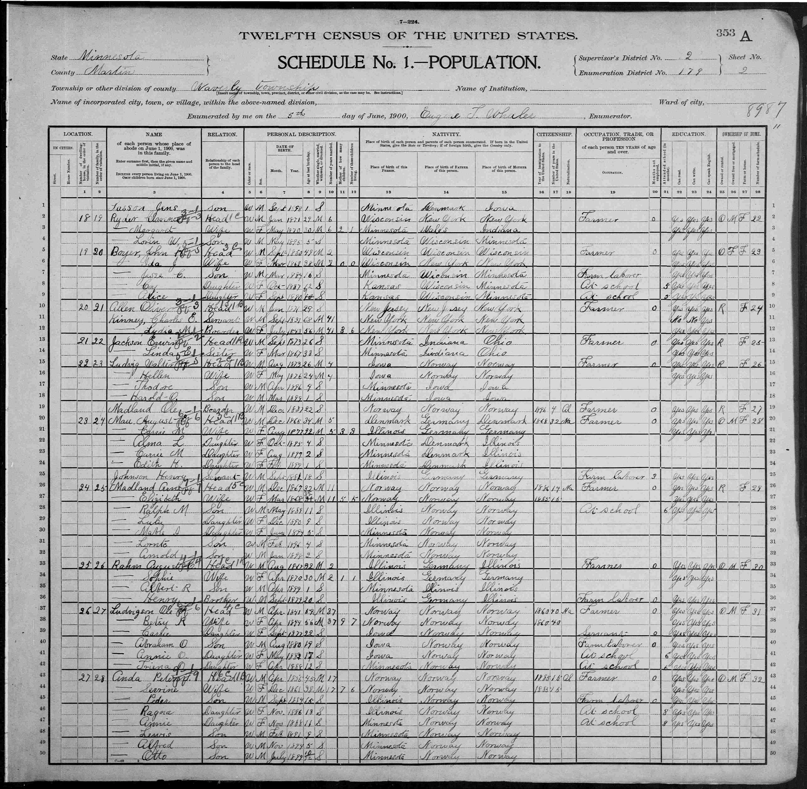

My great grandfather, Ole emigrates from Norway to North Dakota, USA.

My father recalls that Ole arrived in New York and made his way to North Dakota. It seems he spent some time as a boarder on a farm in Minnesota until at least 1900.

***12th US Census (1900) with a record of Ole Madland living in Minnesota.***
