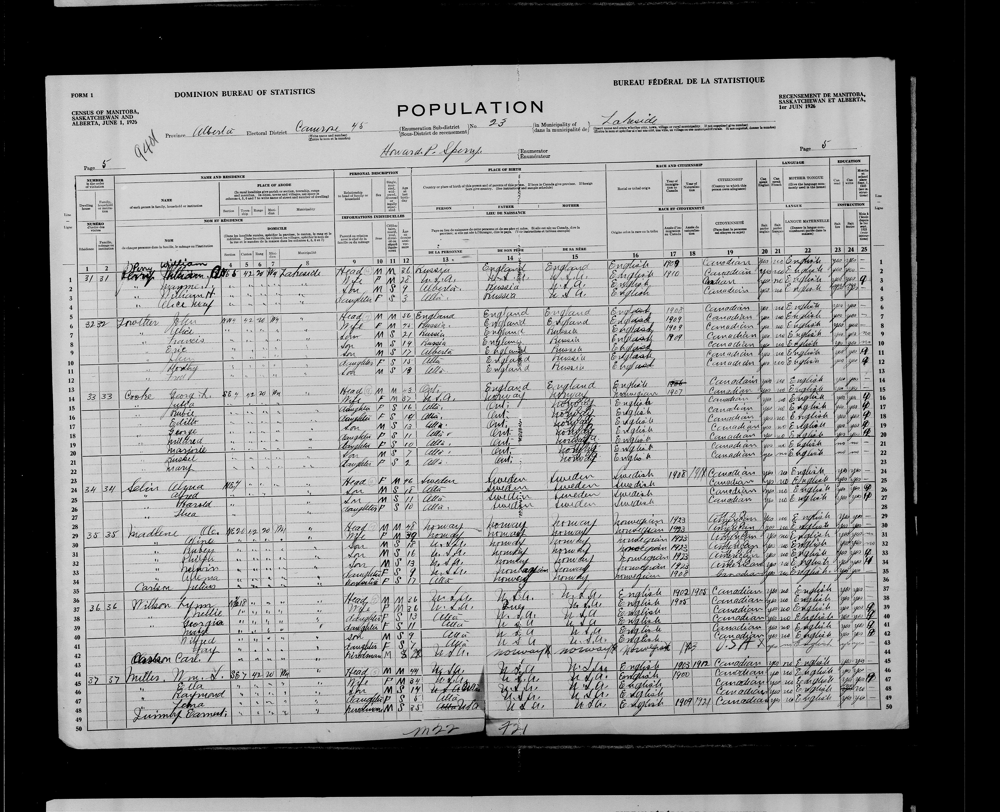
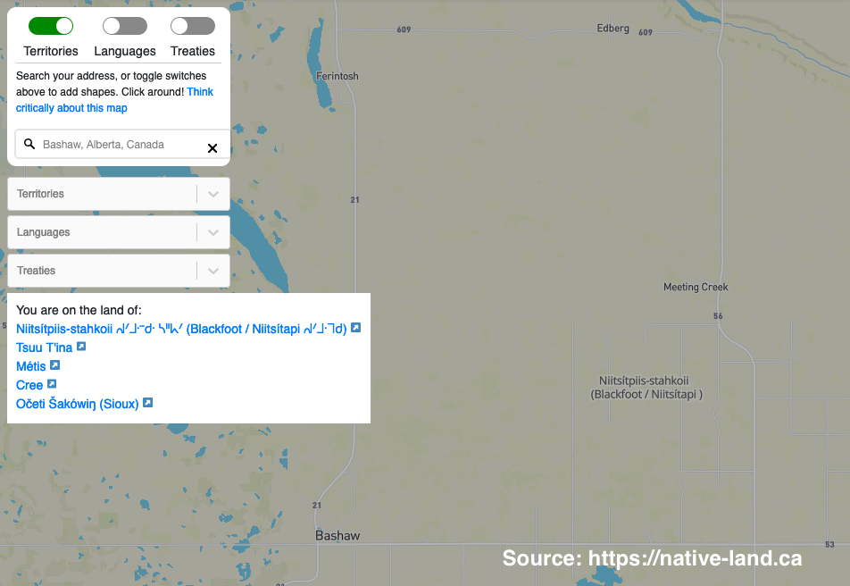
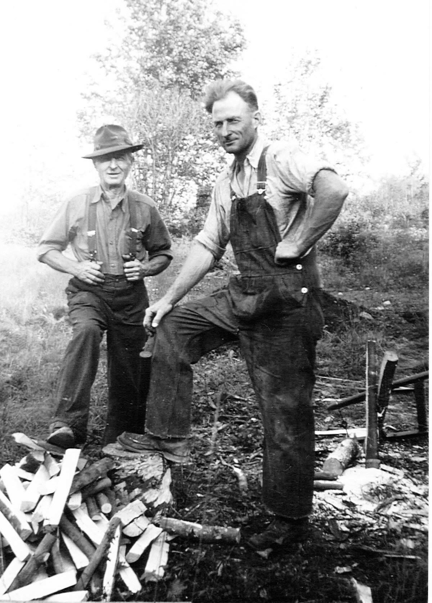

Ole and his family emigrated from Washington State to Alberta, Canada sometime in 1923 (I specified June 1 because I would have rather travelled in nice weather).

I found records indicating that Ole made a homestead claim near Lesser Slave Lake north of Edmonton, Alberta, but he is also recorded in the 1926 census of the Prairie provinces as farming near Camrose, AB, south of Edmonton (line 29; his last name is spelled incorrectly).

It is possible that Ole applied for a quarter section of land for a homestead but was unable to 'prove' it, and instead moved south and leased land south of Camrose.

***1926 Census of the Canadian Prairie Provinces showing Ole living near Camrose, Alberta with his wife, five children, and a boarder.***

<iframe src="https://www.google.com/maps/embed?pb=!1m14!1m8!1m3!1d201297.22705738503!2d-113.01529630913005!3d52.65261607642252!3m2!1i1024!2i768!4f13.1!3m3!1m2!1s0x0%3A0x0!2zNTLCsDM4JzAzLjQiTiAxMTLCsDUwJzI5LjciVw!5e1!3m2!1sen!2sca!4v1576298876596!5m2!1sen!2sca" width="600" height="450" frameborder="0" style="border:0;" allowfullscreen=""></iframe>

***Location of the Northeast quarter of Section 20, Township 42, Range 20, West of the 4th Meridian***

***Location of Ole and Lena's farm in Alberta showing the traditional and ancestral stewards who ceded the land in Treaty 6***

***My great grandfather, Ole Madland (left), with my Grandfather, Reuben, in Alberta in 1934.***
