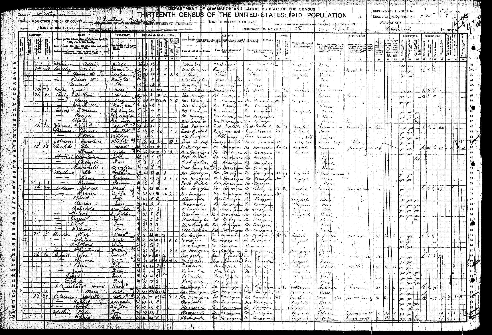
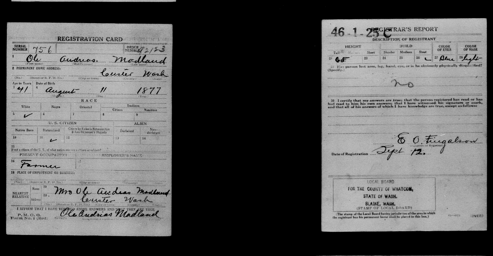

By 1910, Ole was living with his cousin, Ole Brekke, in Custer, Washington (I could not find a specific date of his move to Washington). He was married and had a 2-year-old son, Reuben, my grandfather.

***13th US Census (1910) with a record of Ole Madland living in Custer, Washington***

***Ole's military registration card from 1918.***
