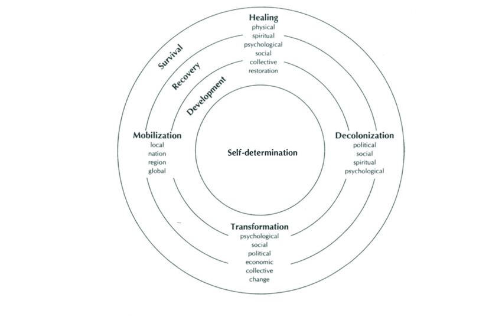

## What is a Worldview or Paradigm?

All research is grounded in a particular tradition or worldview, often called a *paradigm*. A research paradigm is a set of philosophical assumptions and values about the universe and the ways in which we can learn and know about it (Johnson, 2017). According to (Held, 2019), research paradigms are generally concerned with the answers to questions related to:
- how can we know something is true (epistemology)?
- how can we know reality, or if something exists (ontology)?
- how do we know if something is valuable or ethical (axiology)?
- how can we learn about something (methodology)?

The answers to these questions are *foundational to* the research process, rather than being *derived from* the research process, and as such, they are human constructs which cannot be proven or validated, only believed (Held, 2019). Further, each research paradigm affects any given research project undertaken in alignment with that paradigm in very specific ways. In this sense, there is no truly objective research that is free from the biases of the researcher, for even if the researcher has taken significant care to control for bias during the research, the foundational paradigm of the research exerts a profound influence on the outcomes of the research (Held, 2019).

The most common research paradigms have been developed and are grounded in a distinctly *Western* context, meaning that the questions about how we view of reality, how we can know things, which values are important, and how we should approach research have been answered, and are now assumed, based primarily on the views of white European men in the academy (Smith, 1999). Particular research paradigms are common to particular academic disciplines, indicating how researchers in those disciplines have answered the epistemological, ontological, axiological and methodological questions in their disciplines. For example, one paradigm which is commonly used in the natural sciences is *positivism*, characterized by the idea that knowledge is singular, objective, and can be discovered through empirical analysis (Held, 2019). On positivism, if a claim is 'statistically proven', then it is a 'scientific fact'. Notice, however, that the term 'statistically proven' assumes that 'proof' of a claim is possible (epistemology) and desirable (axiology) and that a statistical analysis can provide such proof (epistemology). Notice also that there is an assumption that statistical analyses are 'objective' in that they exclude consideration of values and biases, yet they smuggle axiology in the back door by assuming that empirical analyses ought to be valued more highly than non-empirical analyses.

Other Western paradigms include *constructivist* approaches which have evolved in attempts to more fully explain and understand human experience and are more often used as the basis for qualitative approaches to research, *pragmatic* approaches which blend positivist and constructivist approaches and methods, and *transformative* approaches which value social justice and the emancipation of the oppressed. While constructivist, pragmatic, and transformative approaches have reflected attempts to be inclusive of subjective and experiential ways of knowing, resistance from within the academy has led practitioners of these approaches to define paradigms and methods which are acceptable to those steeped in the values of positivism (Held, 2019).

All of these paradigms have originated in and have been established as the default paradigms for Western higher education. Tragically, when they are applied in research projects involving Indigenous communities and people, they lead to conflict because they are fundamentally based on Western assumptions, rather than Indigenous assumptions. This conflict, according to Indigenous researcher Linda Tuhiwai Smith, has resulted in the word *research* being considered a "dirty" word that elicits memories and associations with "the worst excesses of colonialism" [-@smithDecolonizingMethodologiesResearch1999, p. 1]. Western research projects too often lead to research being conducted *on* and *about* Indigenous peoples leading to an extractive and oppressive didactic relationship rather than a reciprocal and respectful dialectic relationship where research is conducted *by*, *with*, and *for* Indigenous communities (Snow, 2015). This history of the relationship between researchers and Indigenous communities calls for a radically different approach.

In doing the work of improving educational attainment outcomes for Indigenous communities and people, researchers have an obligation to approach Indigenous communities as sovereign nations and as equals in the process. While it is unlikely that there exists a step-wise process leading to utopian research relationships, this review will offer and model some key characteristics of Indigenous research involving both Indigenous and non-Indigenous partners. The following represents an outline of these characteristics and the remainder of this review:
- acknowledgement on the part of the non-Indigenous partner of their role in the research and a commitment to reconciliation and Indigenous self-determination,
- acknowledgement of the poisoned history of colonial research in Indigenous contexts,
- recognition of the worldview of the Indigenous community participating in the research,
- the adoption of research methods that emphasize and foreground local Indigenous voices, honour Indigenous ways of knowing and being, and show reverence for Indigenous views of spirituality, and,
- dissemination of co-constructed findings in ways that respect Indigenous sovereignty over Indigenous knowledge.

### My Role in this Review

As a non-Indigenous researcher, it is incumbent on me to reflect on my role and responsibilities in engaging in research with and for Indigenous people.

I was born in the traditional unceded territory of the Secwépemc people in the interior of present-day British Columbia. When I was 12 years old, my family moved to the traditional lands of the Sema:th people in the eastern Fraser Valley. The Sema:th people are part of the Sto:lō First Nation. Today, I am studying as a guest on the traditional lands of the Lekwungen-speaking peoples on whose traditional territory the University of Victoria stands, and I am grateful for the hospitality of the Songhees, Esquimalt and WSÁNEĆ peoples whose historical relationships with the land continue to this day.

I have been interested in online education for almost 20 years at the time of this writing because it aligns with my sense that education is a powerful force which can be used for good or for evil. I acknowledge with regret that education has been used as a weapon against the lives and culture of the Indigenous people in Canada, and as a result, many Indigenous communities have been destroyed. I commit, through this review and my future research, to learning with humility, privileging the voices of Indigenous researchers and people, and to working towards being a Settler Ally to Indigenous peoples in Coast Salish territories and beyond, as they work towards educational self-determination (Smith, 1999).

Linda Tuhiwai Smith (1999) credits Graham Smith (1992) for identifying four ways in which non-Indigenous researchers may appropriately engage in culturally appropriate research. Smith's recommendations are specific to Māori contexts, but they are included here as guideposts for me in my research. The first model is *tiaki*, where a Māori authority guides and sponsors the research as a mentor. The second is *whangai* where the researcher becomes embedded in the daily life of the Māori people and develops lifelong relationships that transcend the research project. The third model is a power-sharing model where researchers seek the assistance of the community in developing a research enterprise. The fourth is an 'empowering outcomes model' which addresses Māori questions and attains outcomes beneficial to the community.

### Colonial Research

For hundreds of years following the first contact between Indigenous peoples and European colonists, Indigenous peoples have been, and often continue to be, the objects of Western research (Getty, 2009), often with disastrous results. Getty writes about the fact that Western researchers "parachuted" into Indigenous communities, gathered data without being concerned about the questions or problems Indigenous people wanted to solve, and then left without offering anything in return. Data were analyzed and reported from their own Western (positivist) perspective and often, Indigenous communities would be blamed for the problems caused by colonialism. Reports were then used to develop governmental policies designed to further the cause of colonialism. Held (2019) briefly mentions skin grafting experiments performed on Inuit people without their consent, and Smith (1999) writes about researchers measuring the amount of millet seed that could be contained in the skull of an Indigenous person in order to determine their capacity for thought. Linda Tuhiwai Smith (1999) summarizes the colonial research legacy in a heading: "They Came, They Saw, They Named, They Claimed" (p. 80).

These obviously repugnant practices have led Indigenous researchers and communities to push back against Western colonial research paradigms in order to ground research in Indigenous paradigms and to privilege Indigenous voices and work from a liberatory perspective. Further, Indigenous researchers have invited non-Indigenous researchers to also adopt Indigenous paradigms when engaging in research, leading to a broader acceptance of Indigenous perspectives in the academy.

### Indigenous Worldviews

Throughout this review, the term *Indigenous* will be used as a collective noun to refer to people who are *First Nations*, *Métis*, or *Inuit*, terms which refer to distinct Indigenous populations in Canada. It is inaccurate to claim that there is a singular *Indigenous worldview*. In fact, there are over 630 First Nations communities in Canada, many with distinct histories, customs, and worldviews (Wilson, 2019). In addition, there are myriad Indigenous communities across the world with even more diverse backgrounds. There are, however, consistent patterns in how Indigenous people understand and interpret their world, especially on a regional level. For example there is a large group of Indigenous people called the Coast Salish who live in the Cascadia region including south-western British Columbia, north-western Washington State, and small parts of Oregon. Within this large group, there are many smaller communities, such as the *Songhees*, whose historical territory is present-day Victoria, BC, and the *Musqueam* and *Tsawwassen* communities in the present-day Vancouver area (University of Victoria Legacy Art Galleries, 2015). While there are local differences between the smaller communities, there will be regional similarities, often seen in the characteristics of Indigenous artwork or languages(University of Victoria Legacy Art Galleries, 2015). These similarities are due to the fact that there was often a significant amount of interaction between Indigenous communities and that they all lived in the same general, temperate rainforest climate relatively close to the sea and that their worldview is significantly influenced by their reliance on the land for everything.

Mertens et al. (2013) state that Indigenous epistemologies, ontologies, and accountabilities (axiology) are all very relational, meaning that Indigenous worldviews characteristically view the entire cosmos ("between people, past, present and future, and all living and non-living things (p. 16)") as being interconnected and integrated. This inter-relatedness is the foundation of the need for Indigenous research to be respectful and reciprocal, rather than extractive. It forms a basis for the Indigenous ontological view that there is no hierarchy of beings. The entire cosmos is inter-related and interactive, being made up of entities that have volition, and the whole of which is greater than the sum of its parts (Getty, 2009). Indigenous communities value collective solidarity, respect, individual autonomy, responsibility for the land, and living in harmony with all living beings.

Similarly, Indigenous epistemology views knowledge as being highly relational and interconnected. Learning happens through interaction with other people and the natural world, stories and legends, dreams and visions, and through working to maintain inner balance (Getty, 2009). According to Held (2019), there is little to distinguish between Indigenous ontology and epistemology because both are grounded in the inter-relatedness of all things. Held goes on to state that Indigenous values (axiology) are to promote "respectful representation and reciprocity through relational accountability" (p. 6), and that methodologies are participatory, liberatory, and transformative.

### Indigenous Research Methodologies

While Indigenous cultures have been observing and learning from the land for millenia, it has been much more recent that specific research paradigms and methods have been articulated to explicitly challenge the hegemony and cognitive supremacy of Western paradigms. Among the first to do so were Māori researchers in present day New Zealand through the 1990s. Prominent among those researchers is Linda Tuhiwai Smith, author of the seminal book *Decolonizing Methodologies: Research and Indigenous Peoples* (1999). Smith articulates a vision for an Indigenous research agenda with a focus on the self-determination of Indigenous peoples which she describes as

> a goal of social justice which is expressed through and across a wide range of psychological, social, cultural and economic terrains. It necessarily involves the processes of transformation, of decolonization, of healing and of mobilization as peoples. [-@smithDecolonizingMethodologiesResearch1999, p. 116]

Smith uses the diagram in figure 1 to illustrate the agenda.

*Figure 1. The Indigenous Research Agenda. (Smith, 1999, p. 117). This image is copyrighted and is reproduced here under Fair Use guidelines for educational use.*

Smith uses the metaphor of ocean tides, which represent "movement, change, process, life, inward and outward flows of ideas, reflections and actions" (P. 116), in alignment with her people's relationship with the Pacific ocean. The tides, shown as concentric circles, are survival, recovery, development, and self-determination, and they represent "states of being through which Indigenous peoples are moving" (p. 116). These are not necessarily sequential states, because the recovery process must be prioritized based on local needs and the external forces over which Indigenous peoples currently have no control. The four processes (transformation, decolonization, healing, and mobilization) are represented in the diagram as the four cardinal directions (north, west, south, and east) and can be used in research practices and methodologies.

Smith's vision of the Indigenous research agenda is that the movement of Indigenous peoples from mere survival to self-determination are forces as necessary and inexorable as the ocean's tides. If I may extend Smith's metaphor, I might add that the drivers of the tides might be the interactions between the orbits and rotation of the earth (academia, or maybe Indigenous communities), the moon (Indigenous researchers), and the sun (non-Indigenous researchers). The strongest force on the tides is the moon, representing Indigenous researchers who are closest to the question and ought to be the primary voices in Indigenous research. The weaker force is the sun, representing non-Indigenous researchers whose work is more remote from the question, but, when it is aligned with the work of Indigenous researchers, amplifies the force and the impact of Indigenous research. Note that this metaphor does break down when considering the relative brightness and illuminative power of the sun and moon. I emphatically do not argue that non-Indigenous research is somehow more significant because the sun is brighter in the sky than the moon.

Smith provides a brief overview of 25 different Indigenous research projects which took different approaches, but which all were focussed on one or more of three intended outcomes:
> the survival of peoples, cultures, and languages; the struggle to become self-determining, [and] the need to take back control of our destinies. These imperatives have demanded more than rhetoric and acts of defiance. The acts of reclaiming, reformulating, and reconstituting indigenous cultures and languages have required the mounting of an ambitious research programme, one that is very strategic in its purpose and activities and relentless in its pursuit of social justice (1999, p. 142).

Included in Smith's list are the following selections:

- claiming: the process of making claims to territory or rights has led Indigenous researchers to probe deeply into the past to surface stories of Indigenous interests and to write about those stories for both legal and general audiences.
- testimonies: the telling of personal stories of past wrongs which intersects with the act of claiming or reclaiming.
- story telling: stories are oral histories of Indigenous cultures and they play an important part of Indigenous research projects.
- celebrating survival: while much non-Indigenous research focusses on the demise and assimilation of Indigenous peoples, Indigenous researchers have begun to celebrate stories of Indigenous survival and the continuing culture that they have retained. These stories may be in the form of oral histories, songs, or public events and artistic exhibitions.
- Indigenizing: bringing to the forefront, the perspectives and voices of Indigenous peoples and their own stories in their own words and imagery and disconnecting from the dominant Western research paradigm.
- connecting: linking Indigenous peoples to each other through common stories such as creation stories and links to the cosmos.
- representing: strongly linked to social justice (Lambert, 2018), the ability of Indigenous peoples to have a voice in culture is an important component of Indigenous self-determination which has been denied for many years.
- gendering: colonial policies and practices damaged the relationship between Indigenous men and women by imposing patriarchal hierarchies on Indigenous cultures which were previously egalitarian.
- envisioning: the process of pulling together to imagine a new, more hopeful future.
- reframing: so many Indigenous stories are told from a Western paradigm. Reframing those stories from Indigenous perspectives is critical to building greater understanding of issues facing Indigenous communities.
- networking: building international networks has allowed relationships between Indigenous communities and people to flourish, despite a lack of face-to-face contact.
- creating: the ability to create and to be creative is characteristic of Indigenous peoples and has been either suppressed or appropriated by colonial forces. Creativity allows Indigenous peoples to imagine new futures and to exercise self-determination.
- sharing: "Sharing contains views about knowledge being a collective benefit and knowledge being a form of resistance." (1999, p. 160). Sharing knowledge, or 'disseminating results' is a critical form of resistance for Indigenous peoples since they have been failed so many times by Western educational systems.

While it is not necessary for every one of the above actions to be taken in Indigenous research projects (nor is it the case that this is a comprehensive list), these actions represent concrete strategies with which researchers may engage in order to bring about liberatory outcomes for Indigenous peoples as a result of research projects.

In alignment with Smith (1999), Denzin and Lincoln (2019) and Denzin, Lincoln, and Smith (2008) edited a helpful volume which continues to provide a solid foundation for researchers working with Indigenous peoples. Their work is explicitly grounded in Freire's (1990) *Pedagogy of the Oppressed* and his critical pedagogy, which they frame in this volume as *critical Indigenous pedagogy* (CIP). In their introduction to the book, Denzin and Lincoln argue that CIP must be

> ethical, performative, healing, transformative, decolonizing, and participatory. It must be committed to dialogue, community, self-determination, and cultural autonomy. It must meet people's perceived needs. It must resist efforts to confine inquiry to a single paradigm or interpretive strategy. It must be unruly, disruptive, critical, and dedicated to the goals of justice and equity. (p. 2)

There remains a very strong insistence that Western paradigms, particularly *positivist* and *post-positivist* approaches derived from modern natural science research, ought to be subject to critique due to their long history of use and abuse in Indigenous contexts. CIP is described as inherently political due to its explicit goal of Indigenous self-determination and social justice. CIP, while it is political on a global scale, must be enacted on a local scale by answering local questions in light of local political, economic, and historical contexts. To that end, Denzin and Lincoln quote Smith's (2000) eight questions about research projects:

1. What research do we want done?
2. Whom is it for?
3. What difference will it make?
4. Who will carry it out?
5. How do we want the research done?
6. How will we know it is worthwhile?
7. Who will own the research?
8. Who will benefit? (p. 239)

These questions must be answered to show that "indigenous persons must conduct, own, and benefit from any research that is done on, for, or with them" (Denzin, 2019a, p. 9).

### Indigenous Research in Canada

In Canada, the *Truth and Reconciliation Commission* (TRC) (The Truth and Reconciliation Commission of Canada, 2015) resulted in the publication of 94 Calls to Action and a subsequent commitment from the Government of Canada to fully implement each of the 94 recommendations, several of which address Indigenous rights to self-determination and education. Additionally, the Prime Minister of Canada, Justin Trudeau, in his Mandate Letter to the Minister of Indigenous Services (Trudeau, 2017b) requires the minister to
> Implement Budget 2017 enhancements to the Post-Secondary Student Support Program, and work with the Minister of Employment, Workforce Development and Labour as well as Indigenous partners to undertake a review of all current federal programs that support Indigenous students choosing to pursue post-secondary education.  The purpose of the review is to ensure these programs meet the needs of individual students while supporting completion of a post-secondary credential.

Further, in his Mandate Letter to the Minister of Crown-Indigenous Relations and Northern Affairs (Trudeau, 2017a), Trudeau requires the minister to

> Lead a whole-of-government approach to the renewal of a nation-to-nation, Inuit-Crown, and government-to-government relationship with Indigenous Peoples including implementation of the permanent bilateral processes, advancing distinctions-based policy, and improving our capacity as a government to consider and respond to the unique realities of Indigenous Peoples in Canada.

and

> Continue to develop and lead a whole-of-government strategy to include Indigenous representatives in meaningful ways in Canada’s federal‑provincial-territorial dialogues.

Finally, in 2016, the *Social Sciences and Humanities Research Council (SSHRC)* (Government of Canada, 2018) launched a program intended to engage researchers, graduate students, and Indigenous leaders and communities to answer the question
> How are the experiences and aspirations of Aboriginal Peoples in Canada essential to building a successful shared future?

The resulting report highlighted that Indigenous research in the social sciences and humanities is a key driver for building mutually respectful relationships between Indigenous and non-Indigenous communities. As such, researchers called for

> future research to be more participatory and collaborative, led by Indigenous communities, and grounded in Indigenous worldviews and approaches to research. Meaningful and inclusive dialogue between communities, researchers and all levels of government is critical to building upon and applying resulting knowledge. (2018)

Drawson, Toombs and Mushquash (2017) catalogued Indigenous research methods in a review of a selection of 64 peer-reviewed and published articles in order to learn what methods researchers were using and to identify commonalities among different methods. They did not evaluate the selected articles for quality as the rubric most often used for doing so is biased towards randomized controlled trials. They identified five themes in the articles they reviewed: "General Indigenous Frameworks, Western Methods in an Indigenous Context, Community-Based Participatory Research (CBPR), Storytelling, and Culture-Specific Methods" (2017, p. 3). They found that there was an implicit equivocation in that some researchers used the term *method* to describe both a *framework* or paradigm and a "*technique for data collection or analysis*" (emphasis mine) (2017, p. 3). They only found one article with a clear definition of Indigenous research methods which was "one where the researcher understands the role of Indigenous history, culture, language, and self-determination in the lives of Indigenous Peoples" (Makomenaw, 2012, p. 858). The Western methods they found were photovoice, autoethnography, mixed methods, self-location, and emic-etic approaches (*emic* refers to universal factors and *etic* to specific Indigenous factors). CBPR was found to be common in Indigenous research projects because it specifically involves the community in the process and it prioritizes their needs and perspectives and it can also accommodate other specifically Indigenous methods such as storytelling. Storytelling is particularly important in Indigenous research projects because it is so closely aligned with Indigenous epistemologies and pedagogies which both emphasize the oral transmission of cultural knowledge through stories told by elders to younger members of the community. Drawson et al. specifically note that, according to Cunsolo Willox, Harper, and Edge (2012)), digital storytelling can serve to remove the researcher and their biases from the research process. They conclude with a discussion of research methods specific to particular indigenous cultures around the world, including in North America where there is, among some Indigenous Peoples, a connection between the sacredness of tobacco and receiving assistance from an Elder (Wilson & Restoule, 2010). They also identified talking circles for sharing and discussion, symbol-based reflection where participants created artwork symbolic of their feelings and then reflect on that symbolism in a sharing circle, *mino-bimaadiziwin* (Anishinaabe for "the Good Life"), *wahkohtowin* (Cree for "kinship/relatedness") where relationship form the basis for coming to a common understanding, and, finally, *etuaptmumk* (Mi'kmaq for "two-eyed seeing") which blends Western and Indigenous ways of knowing.

"Two-eyed seeing" is a term coined by Mi'kmaq Elder Albert Marshall to describe the integration of Indigenous and Western ways of knowing (Marshall, 2017). Elder Marshall describes two-eyed seeing as:

> learn[ing] to see from your one eye with the best or the strengths in the Indigenous knowledges and ways of knowing … and learn[ing] to see from your other eye with the best or the strengths in the mainstream (Western or Eurocentric) knowledges and ways of knowing … but most importantly, learn[ing] to see with both these eyes together, for the benefit of all (2017, para. 2).

It is not taking bits and pieces from one or the other way of knowing, but weaving together knowledge from both systems and a journey of co-learning that occurs between Indigenous and non-Indigenous learners (Bartlett, 2012).

##### 5Rs

Regardless of the specific method utilized within an Indigenous research paradigm, there are five general requirements of researchers engaging in research with Indigenous communities collectively known as the 5Rs: respect, reciprocity, relevance, responsibility, and relationships as outlined and described initially (as 4Rs) by Kirkness and Barnhardt (1991), and later by Tessaro et al. (2018) (who include the fifth R, relationships). It is critical for Indigenous learning environments to be respectful of Indigenous values, specifically the lack of hierarchy in Indigenous cultures where every person is equal to every other person. This can clearly be a problem as modern Canadian universities are very hierarchical and bureaucratic, leading Indigenous learners feeling alienated. Reciprocity is important because for decades, Indigenous communities have been the objects of Western greed, research, and experimentation with researchers seeking only to answer an academic question. This extractive exploitation of Indigenous knowledge is deeply problematic. It is essential for research to be mutually beneficial with the community receiving tangible and durable benefits. Indigenous research must also be relevant to the community's needs as identified by the community. Past extractive and exploitative projects have sought only to resolve outsiders' questions and curiosity about Indigenous communities, rather than listening to the actual questions and curiosity of the Indigenous communities themselves. With the deeply interrelated nature of Indigenous communities, it is also important for there to be a clear sense of responsibility for each individual to uphold the cultural norms of the community. This includes the responsibilities of the researcher in their work, but also the responsibilities of the participants to be mindful of what they can and cannot share. Finally, relationships are the foundation of Indigenous research. The other four R's depend on the existence and maintenance of healthy relationships between the researcher, community Elders, and participants.

### Disseminating Indigenous Knowledge

While this version of this review is far from exhaustive and there are many other ideas that should be explored, the final idea that I will consider here will be the appropriate dissemination of Indigenous knowledge, especially as revealed through research. In alignment with the requirement that Indigenous research lead to self-determination of Indigenous Peoples and the historical abuses perpetrated by Western researchers, the First Nations Information Governance Centre via its precursor organizations has articulated "a set of standards that establish how First Nations data should be collected, protected, used, or shared" (FNIGC, 2019). These principles, known collectively as *OCAP*, assert that First Nations have ownership, control, access, and possession of data collected in their communities and are

>a set of principles that reflect First Nation commitments to use and share information in a way that brings benefit to the community while minimizing harm. It is also an expression of First Nation jurisdiction over information about the First Nation" (FNIGC, 2014, p. 4-5)

Ownership in this case is the community's collective ownership over their information, knowledge, and data and is analogous to an individual's ownership of their personal information, knowledge, and data. The idea of control indicates that First Nations communities alone may determine how their information is used and shared. In order to exercise ownership and control over their information, First Nations communities must have access to it and also be able to determine who else may access it, and they must also be able to physically possess the information (FNIGC, 2014).

## Summary

Research conducted by non-Indigenous researchers, like myself, with Indigenous communities is fraught with potential for misunderstanding, misrepresentation, and misappropriation due to a long history of these abuses by Western researchers. In order to proceed with my intended research in alignment with the 5Rs (Kirkness & Barnhardt, 1991; Tessaro et al., 2018), it is necessary for me to:

- acknowledge my role in the research and a commit to working to support reconciliation and Indigenous self-determination (Smith, 1999),
- acknowledge of the poisoned history of colonial research in Indigenous contexts (Denzin, Lincoln, & Smith, 2019),
- recognize and privilege the worldview of the Indigenous community participating in the research (Held, 2019),
- adopt research methods that emphasize and foreground local Indigenous voices, honour Indigenous ways of knowing and being, and show reverence for Indigenous views of spirituality (Wilson & Restoule, 2010), and,
- disseminate co-constructed findings in ways that respect Indigenous sovereignty over Indigenous knowledge by following the principles of OCAP (FNIGC, 2014).

While this review is, as yet, incomplete, I am more able to articulate the importance of decolonizing my ideas and biases related to my studies. I originally intended for this to be a review of specific methods for engaging in Indigenous research but have discovered that there is much more work to be done in understanding Indigenous research paradigms. That being said, there are at least two approaches which seem compelling *to me* (yet subject to further critique and input from Indigenous people). The first is *etuaptmumk*, or two-eyed seeing (Bartlett, Marshall, & Marshall, 2012; Marshall, 2017). While, as a white settler, I cannot ever fully 'see' with even one Indigenous eye, I can 'listen' and let Indigenous voices tell me what they see and *co-construct* with those people a braided or blended view of my view and theirs that draws from the strengths of both of us. The second approach, which is compelling due to its proximity to my research interest of online learning, is the idea of digital storytelling (Cunsolo Willox, Harper, & Edge, 2012). It is also compelling because storytelling itself is a long revered mode of knowledge sharing in Indigenous communities as Elders pass on their knowledge through stories.

#### References

Bartlett, C., Marshall, M., & Marshall, A. (2012). Two-Eyed Seeing and other lessons learned within a co-learning journey of bringing together indigenous and mainstream knowledges and ways of knowing. _Journal of Environmental Studies and Sciences_, _2_(4), 331–340. [https://doi.org/10.1007/s13412-012-0086-8](https://doi.org/10.1007/s13412-012-0086-8)

Truth and Reconciliation Commission of Canada (2015). Truth and Reconciliation Commission of Canada: Calls to Action. Truth and Reconciliation Commission of Canada. Retrieved from [http://nctr.ca/assets/reports/Calls\_to\_Action\_English2.pdf](http://nctr.ca/assets/reports/Calls_to_Action_English2.pdf)

Cunsolo Willox, A., Harper, S. L., & Edge, V. L. (2012). Storytelling in a digital age: Digital storytelling as an emerging narrative method for preserving and promoting indigenous oral wisdom. _Qualitative Research_, _13_(2), 127–147. [https://doi.org/10.1177/1468794112446105](https://doi.org/10.1177/1468794112446105)

Denzin, N. K., & Lincoln, Y. S. (2019). Handbook of Critical and Indigenous Methodologies. In pages 1-20. Thousand Oaks, California: SAGE Publications, Inc. [https://doi.org/10.4135/9781483385686](https://doi.org/10.4135/9781483385686)

Denzin, N. K., Lincoln, Y. S., & Smith, L. T. (Eds.). (2008). _Handbook of critical and indigenous methodologies_. Los Angeles: Sage.

Denzin, N., Lincoln, Y., & Smith, L. (2019). _Handbook of Critical and Indigenous Methodologies_. Thousand Oaks, California: Sage Publications. [https://doi.org/10.4135/9781483385686](https://doi.org/10.4135/9781483385686)

Drawson, A., Toombs, E., & Mushquash, C. (2017). Indigenous Research Methods: A Systematic Review. _International Indigenous Policy Journal_, _8_(02). [https://doi.org/10.18584/iipj.2017.8.2.5](https://doi.org/10.18584/iipj.2017.8.2.5)

FNIGC. (2014). _Ownership, Control, Access and Possession (OCAP™): The Path to First Nations Information Governance_. Retrieved from [https://ezproxy.kpu.ca:2443/login?url=http://www.deslibris.ca/ID/10095457](https://ezproxy.kpu.ca:2443/login?url=http://www.deslibris.ca/ID/10095457)

FNIGC. (2019). The First Nations Principles of OCAP. Retrieved April 6, 2019, from [http://fnigc.ca/ocapr.html](http://fnigc.ca/ocapr.html)

Freire, P. (1990). _Pedagogy of the oppressed_. Harmondworth: Penguin.

Getty, G. A. (2009). The Journey Between Western and Indigenous Research Paradigms. _J Transcult Nurs_, _21_(1), 5–14. [https://doi.org/10.1177/1043659609349062](https://doi.org/10.1177/1043659609349062)

Government of Canada, S. S. and H. R. C. (2018, August 1). Social Sciences and Humanities Research Council. Retrieved March 25, 2019, from [http://www.sshrc-crsh.gc.ca/society-societe/community-communite/ifca-iac/03-aboriginal\_peoples\_in\_Canada\_report-les\_peuples\_autochtones\_en\_Canada\_rapport-eng.aspx](http://www.sshrc-crsh.gc.ca/society-societe/community-communite/ifca-iac/03-aboriginal_peoples_in_Canada_report-les_peuples_autochtones_en_Canada_rapport-eng.aspx)

Held, M. B. E. (2019). Decolonizing Research Paradigms in the Context of Settler Colonialism: An Unsettling, Mutual, and Collaborative Effort. _International Journal of Qualitative Methods_, _18_. [https://doi.org/10.1177/1609406918821574](https://doi.org/10.1177/1609406918821574)

Johnson, R. B., & Christensen, L. (2017). _Educational research: Quantitative, qualitative and mixed approaches_ (6th ed.). Thousand Oaks, CA: Sage Publications.

Kirkness, V. J., & Barnhardt, R. (1991). First Nations and Higher Education: The Four R&#39;s– Respect, Relevance, Reciprocity, Responsibility. _Journal of American Indian Education_, _30_(3), 1–15. Retrieved from [https://eric.ed.gov/?id=EJ438242](https://eric.ed.gov/?id=EJ438242)

Lambert, S. R. (2018). Changing our (Dis)Course: A Distinctive Social Justice Aligned Definition of Open Education. _Journal of Learning for Development - JL4D_, _5_(3). Retrieved from [http://www.jl4d.org/index.php/ejl4d/article/view/290](http://www.jl4d.org/index.php/ejl4d/article/view/290)

Makomenaw, M. V. A. (2012). Welcome to a new world: Experiences of American Indian tribal college and university transfer students at predominantly white institutions. _International Journal of Qualitative Studies in Education_, _25_(7), 855–866. [https://doi.org/10.1080/09518398.2012.720732](https://doi.org/10.1080/09518398.2012.720732)

Marshall, A. (2017). Two-Eyed Seeing – Elder Albert Marshall&#39;s guiding principle for inter-cultural collaboration. In _Thinkers Lodge_. Pugwash, NS. Retrieved from [http://www.integrativescience.ca/uploads/files/Two-Eyed%20Seeing-AMarshall-Thinkers%20Lodge2017(1).pdf](http://www.integrativescience.ca/uploads/files/Two-Eyed%20Seeing-AMarshall-Thinkers%20Lodge2017(1).pdf)

Mertens, D. M., Cram, F., & Chilisa, B. (Eds.). (2013). _Indigenous pathways into social research: Voices of a new generation_. Walnut Creek, Calif: Left Coast Press.

Smith, G. H. (1992). Research issues related to maori education. In _The Issue of Research and Māori_. Aukland, NZ: Research Unit for Māori Education.

Smith, L. T. (1999). _Decolonizing methodologies: Research and indigenous peoples_. London ; New York : Dunedin, N.Z. : New York: Zed Books ; University of Otago Press ; Distributed in the USA exclusively by St. Martin&#39;s Press.

Snow, K. C., Hays, D. G., Caliwagan, G., Ford, D. J., Mariotti, D., Mwendwa, J. M., & Scott, W. E. (2015). Guiding principles for indigenous research practices. _Action Research_, _14_(4), 357–375. [https://doi.org/10.1177/1476750315622542](https://doi.org/10.1177/1476750315622542)

Tessaro, D., Restoule, J.-P., Gaviria, P., Flessa, J., Lindeman, C., & Scully-Stewart, C. (2018). The Five R&#39;s for Indigenizing Online Learning: A Case Study of the First Nations Schools&#39; Principals Course. _Canadian Journal of Native Education_, _40_(1), 125–143. Retrieved from [https://www.researchgate.net/publication/328289320\_The\_Five\_R%27s\_for\_Indigenizing\_Online\_Learning\_A\_Case\_Study\_of\_the\_First\_Nations\_Schools%27\_Principals\_Course](https://www.researchgate.net/publication/328289320_The_Five_R%27s_for_Indigenizing_Online_Learning_A_Case_Study_of_the_First_Nations_Schools%27_Principals_Course)

Trudeau, J. (2017a, August 28). Minister of Crown-Indigenous Relations and Northern Affairs Mandate Letter (October 4, 2017). Retrieved March 25, 2019, from [https://pm.gc.ca/eng/minister-crown-indigenous-relations-and-northern-affairs-mandate-letter](https://pm.gc.ca/eng/minister-crown-indigenous-relations-and-northern-affairs-mandate-letter)

Trudeau, J. (2017b, August 28). Minister of Indigenous Services Mandate Letter (October 4, 2017). Retrieved March 25, 2019, from [https://pm.gc.ca/eng/minister-indigenous-services-mandate-letter-october-4-2017](https://pm.gc.ca/eng/minister-indigenous-services-mandate-letter-october-4-2017)

Victoria Legacy Art Galleries, U. of. (2015a). Coast Salish Design Elements | Perpetual Salish. Retrieved March 29, 2019, from [http://uvac.uvic.ca/gallery/salishcurriculum/coast-salish-design-elements/](http://uvac.uvic.ca/gallery/salishcurriculum/coast-salish-design-elements/)

Victoria Legacy Art Galleries, U. of. (2015b). Coast Salish Territories Maps. Retrieved March 28, 2019, from [http://uvac.uvic.ca/gallery/salishcurriculum/coast-salish-territories-maps/](http://uvac.uvic.ca/gallery/salishcurriculum/coast-salish-territories-maps/)

Wilson, D. D., & Restoule, J.-P. (2010). Tobacco Ties: The Relationship of the Sacred to Research. _Canadian Journal of Native Education_, _33_(1), 29–45, 156. Retrieved from [http://search.proquest.com.ezproxy.library.uvic.ca/docview/864885295?accountid=14846](http://search.proquest.com.ezproxy.library.uvic.ca/docview/864885295?accountid=14846)

Wilson, K. (2019). _Pulling Together: Foundations Guide_. Retrieved from [https://opentextbc.ca/indigenizationfoundations](https://opentextbc.ca/indigenizationfoundations)
