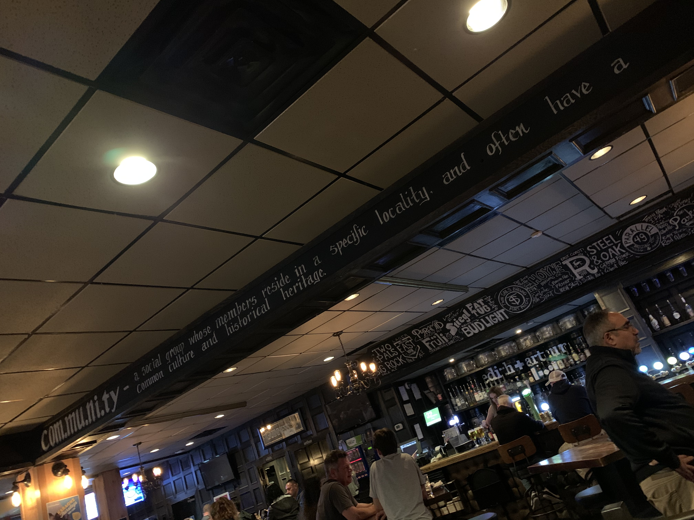

### Community Interaction

The community with which I chose to engage was a selection of faculty from the Indigenous Education (IE) department at the University of Victoria. This is a community with which I have a previous, though brief, relationship. In July 2019, I was invited to participate as a panelist in a conversation on the topic of Relationships and Community Building. The two main presenters were both scholars, one being a white settler and one Indigenous. The event was an ‘unconference’ where the attendees listened to the presentations and the panel discussion, then had opportunity to offer questions or topics to discuss in breakout sessions. Each of the panelists was responsible for moderating one of the breakout sessions. The session I co-moderated focussed on how settler teachers can better integrate Indigenous perspectives in their teaching. My co-moderator was one of the faculty from the IE department and was one of the people I invited to participate in this community exercise. Another participant was a floating moderator of the unconference event, and the final participant is a member of the IE department at University of Victoria and is also one of my dissertation committee members.

I invited participation from these three scholars, but it was challenging to meet in-person as I had only one day where I would be in Victoria, and that was to be a very short day for other reasons. In the end, I was only able to meet in-person with one of the people that I invited, but the conversation was robust and they were able to give me a sense of perspective on the nature of the community and we were able to identify an action research question that is grounded in their needs as a community.

Aside from that meeting, I was able to interact with all three invitees via email and received positive affirmations about the work I am proposing in my dissertation as well as the smaller project of proposing an action research question for the purposes of EDCP512A.

### Description of Community Context

One of the challenges of being a visiting student at UBC is that my primary academic community is not local to me, so the nature of the community is both challenging and somewhat problematic. One challenge is that the members of the community are distributed across geographic space, making in-person connections difficult. One problem, as articulated by one of the community members, is the question of how to define a community. Who gets to decide what does and does not constitute a community?

For example, I was eating dinner in a local pub a few days ago, and on their wall was a 'definition' of community.

The writing in the image is a little difficult to read and it says:

> community: a social group whose members reside in a specific locality and often have a common culture and heritage

While this definition might be appropriate for a neighbourhood pub, it seems inadequate to describe the community I met with for this assignment as we don’t live in the same specific locality and we don’t share a common heritage or culture. We may share experiences of having grown up in Canada, but as Indigenous people, their lived experience of growing up in Canada were likely very different from mine.

It may be correctly argued that criticizing a saying on a wall in a pub as a definition in a scholarly context is a straw man argument; as such, I consulted the Merriam-Webster dictionary, and found very similar ideas.

<a class="embedly-card" data-card-controls="0" href="https://www.merriam-webster.com/dictionary/community">Definition of COMMUNITY</a>

Many of the definitions of community listed there include the ideas of common places, interests, culture, and heritage, but one definition stands out as being a key to this community, and that is “a social state or condition” (“Definition of COMMUNITY,” n.d.). In this sense, community is intentional rather than an accident of geography or birth. For this small community of Indigenous and non-Indigenous scholars and educators (myself and three Indigenous scholars) at UVic, there is a definite intention to build this kind of community where learners, faculty, and staff have a sense that they *belong* in higher education.

The discussion above highlights some of the problems with defining community in modern Canadian universities, and it also applies to this small community of four people. At present, I would argue we have an emerging sense of solidarity in light of our common interest in Indigenous education in BC and Canada. While there are both geographic and temporal barriers to us forming a community, we have used technology (email) to overcome those barriers. The emerging nature of the community means that there is work to do in order to build trust, a critical component of action research communities (Collins, 2004; Pedretti, 1996).

We initially came together through the aforementioned unconference in July 2019 and through the process of planning my dissertation committee. This assignment for EDCP512 has provided a good connection point for me to invite further conversation, to build trust, and to begin a tentative and iterative cycle of forming a research question for both the IE department and for my dissertation (McTaggart, 1991 in Collins, 2004).

### Community values

In my interactions with the scholars from the IE department, one word seems to stand out among other possible descriptors: “resurgence”. It is common knowledge that Indigenous Peoples living in Canada have been, and continue to be, on the wrong end of horrific abuses, discriminatory policies and laws, and endless broken promises, leaving their communities devastated. The IE department at UVic, along with this fledgling community, places a very high value on building confidence and capacity in the larger community of Indigenous learners and scholars attending the university, ultimately leading to a resurgent Indigenous community (broadly speaking) with tangible influence as sovereign, self-determined Nations.

Among the values of this smaller community is the idea of individual autonomy. By that, I refer to comments made at the unconference and directed toward the white settler educators in the audience that we need to do our homework with respect to the history of Canada’s treatment of Indigenous Peoples. There should be little need for white settlers to ask Indigenous people what they want; they have already told us. Once we have done that work, then we can consider ourselves ready to work towards another value of the community, which could be described as collegial allyship. We value collegiality in the sense we are members of a broad scholarly community at the university, and we value allyship because Indigenous and non-Indigenous scholars need to walk together in order to enable Indigenous learners to become resurgent in Canada and the world.
### My role

There is a long and terrible history of abuses perpetrated against Indigenous Peoples by white settler researchers seeking knowledge about Indigenous Peoples. Their methods have been both extractive and destructive, often leading to government policies that oppress Indigenous communities (Smith, 1999). As a white settler and action researcher, my role, following Conrad (2015), is primarily to listen and walk alongside Indigenous people as they work through issues that are important to them. While I may have expertise in educational technology, they understand the nature and values of their community, and I cannot seek to impose my expertise regardless of how I think it may be useful.

With that in mind, in my meeting with one of the members of the community, they suggested that they need help figuring out how to allow faculty to supervise practicum learners working remotely. Complicating the normal challenges of learners in remote locations, the practicum supervisor is experiencing temporary limitations in mobility. The question as suggested by the community is how to enable supportive practicum supervision for learners, while also supporting the full physical recovery of the practicum supervisor.

This is an ideal question for an action research project for this little community as it is grounded in the needs of the larger Indigenous community and there it is clear that this would be a libratory project for those involved and impacted (Hall, 1992).
 
### References

Collins, S. (2004). Ecology and ethics in participatory collaborative action research: An argument for the authentic participation of students in eduational research. *Educational Action Research, 12*(3), 347–362. <https://doi.org/10.1080/09650790400200255>

Conrad, D. (2015). Education and Social Innovation: The Youth Uncensored Project—A Case Study of Youth Participatory Research and Cultural Democracy in Action. *Canadian Journal of Education / Revue Canadienne de l’éducation, 38*(1), 1–25. Retrieved from JSTOR.

Definition of COMMUNITY. (n.d.). Retrieved October 23, 2019, from <https://www.merriam-webster.com/dictionary/community>

Hall, B. L. (1992). From Margins to Center? The Development and Purpose of Participatory Research. *The American Sociologist, 23*(4), 15–28. Retrieved from JSTOR.

Pedretti, E. (1996). Facilitating Action Research in Science, Technology and Society (STS) Education: An experience in reflective practice. *Educational Action Research, 4*(3), 307–327. <https://doi.org/10/dzpkqp>

Smith, L. T. (1999). *Decolonizing methodologies: Research and indigenous peoples.* London; New York.
