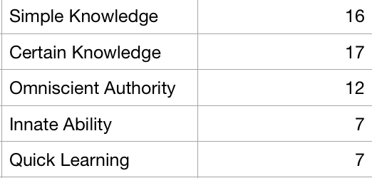

In class # 2 of EDCI 681, we were assigned some homework to work through this Epistemic Beliefs Inventory based on

!!! Adapted from Wang, X., Zhang, Z., Zhang, X., & Hou, D. (2013). Validation of the Chinese version of the Epistemic Beliefs Inventory using confirmatory factor analysis. International Education Studies, 6(8), 98-111.

===

Here are my results:

And here is a quick explainer of what each means:

- Simple Knowledge (SK) ranges from knowledge as compartmentalized as isolated bits to knowledge as highly integrated and interwoven.
- Certain Knowledge (CK) measures knowledge as absolute to knowledge as constantly evolving.
- Innate Ability (IA) ranges from ability to learn as genetically predetermined to ability to learn as acquired through experience.
- Omniscient Authority (OA) ranges from knowledge as handed down by omniscient authority to knowledge as reasoned out through objective and subjective means.
- Quick Learning (QL) ranges from learning as quick or not-at-all to learning as a gradual process

Seems like a relatively accurate snapshot of my views. Knowledge is integrated and interwoven, evolving, reasoned out, and acquired gradually through experience.

That being said, it was pretty easy to predict (and therefore influence) which questions were aiming at particular things. Knowing that there are almost always 'categories' of questions, I typically try to identify what the survey is trying to get at. This particular instrument was relatively transparent in a few of the categories, like authority and ease of learning.

I have a hard time taking 'inventories' seriously, perhaps because I've been jaded by all the MBTI and other similar personality inventories that claim objectivity because science.

One of the troubles with these types of things is that they are compelling because they offer quick answers to easily answerable (usually intentionally polarizing) questions. But it's a good thing that nobody could use these things to do something drastic like influence a national election, right?
