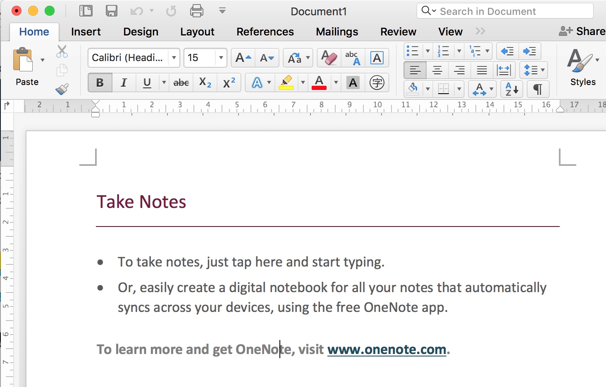
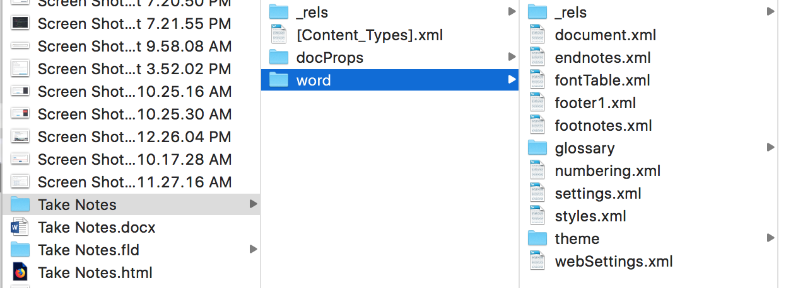
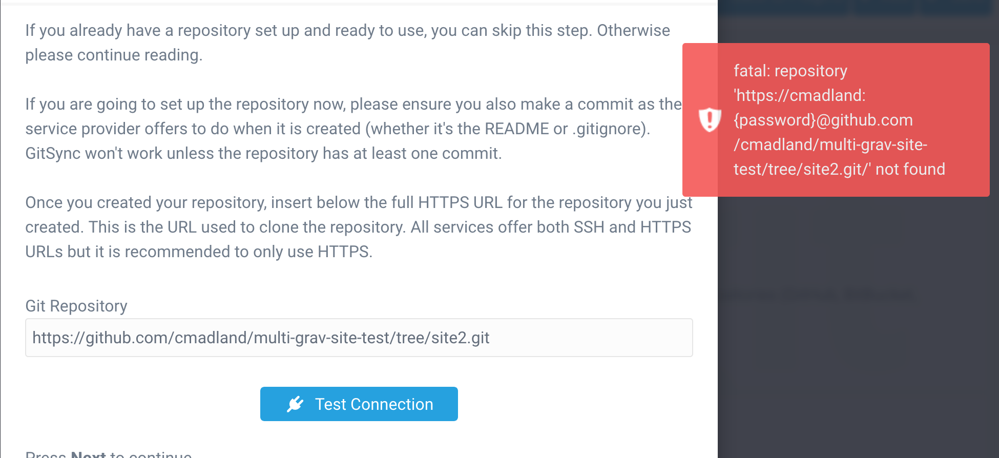
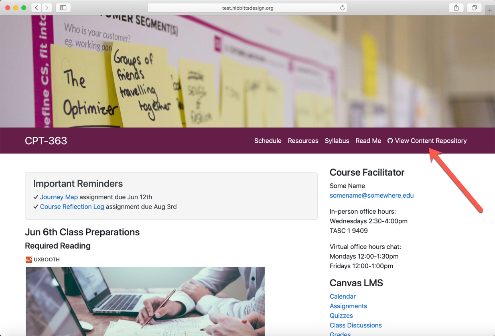
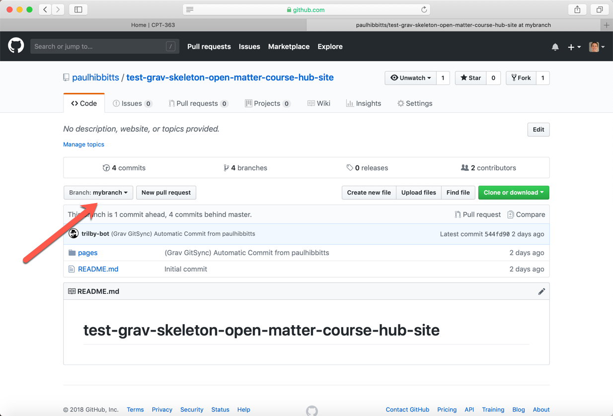

Sometimes, things happen in ways that are nothing short of serendipitous. Yesterday was a good example.

I am in the middle of envisioning and building the technical infrastructure for what is intended to be a world-wide initiative.

===

The general idea is that of a system of micro-campuses in China, Kenya, India, Japan, and who knows where else. The [University of Arizona](https://microcampus.arizona.edu/) has a nice overview of the concept on their site. The short story is that a micro-campus is a remote branch of the main campus located on the campus of a partner university offering credentials from the main campus.

One challenge presented by this model is that we might have a course, maybe called `Course 101` which is offered as a core requirement for all students on the main campus and which we also want to offer towards a credential at partner universities in China and Kenya. As this is a course towards a TWU degree, we have an interest in maintaining some quality control over the course. But, since it will be offered in radically different cultural contexts (Langley, Kenya, and India), there also needs to be allowance for localization of the materials and the logistics.

This is where git comes in. Git is software that allows authors to manage different versions of documents, which are composed in plain text. These are two characteristics of git that make it ideal for managing content for the web.

#### Plain text

The page that you are reading is composed in plain text and styled with Markdown. Here is the difference between using plain text and a Werd document.

I just created a Werd doc from a template and saved it as .docx.



This is a very simple document of 40 words. There are four styles of text:
# Heading 1
## Heading 2
* list bullet

[Hyperlink](www.onenote.com)

Then I opened the file with Unarchiver on my Mac to have a look at the contents of the file (which is actually a folder full of files, as below).



I then opened that `document.xml` file to have a look at how the document is styled. Here is what I saw.

`<w:document xmlns:wpc="http://schemas.microsoft.com/office/word/2010/wordprocessingCanvas" xmlns:cx="http://schemas.microsoft.com/office/drawing/2014/chartex" xmlns:cx1="http://schemas.microsoft.com/office/drawing/2015/9/8/chartex" xmlns:cx2="http://schemas.microsoft.com/office/drawing/2015/10/21/chartex" xmlns:cx3="http://schemas.microsoft.com/office/drawing/2016/5/9/chartex" xmlns:cx4="http://schemas.microsoft.com/office/drawing/2016/5/10/chartex" xmlns:cx5="http://schemas.microsoft.com/office/drawing/2016/5/11/chartex" xmlns:cx6="http://schemas.microsoft.com/office/drawing/2016/5/12/chartex" xmlns:cx7="http://schemas.microsoft.com/office/drawing/2016/5/13/chartex" xmlns:cx8="http://schemas.microsoft.com/office/drawing/2016/5/14/chartex" xmlns:mc="http://schemas.openxmlformats.org/markup-compatibility/2006" xmlns:aink="http://schemas.microsoft.com/office/drawing/2016/ink" xmlns:am3d="http://schemas.microsoft.com/office/drawing/2017/model3d" xmlns:o="urn:schemas-microsoft-com:office:office" xmlns:r="http://schemas.openxmlformats.org/officeDocument/2006/relationships" xmlns:m="http://schemas.openxmlformats.org/officeDocument/2006/math" xmlns:v="urn:schemas-microsoft-com:vml" xmlns:wp14="http://schemas.microsoft.com/office/word/2010/wordprocessingDrawing" xmlns:wp="http://schemas.openxmlformats.org/drawingml/2006/wordprocessingDrawing" xmlns:w10="urn:schemas-microsoft-com:office:word" xmlns:w="http://schemas.openxmlformats.org/wordprocessingml/2006/main" xmlns:w14="http://schemas.microsoft.com/office/word/2010/wordml" xmlns:w15="http://schemas.microsoft.com/office/word/2012/wordml" xmlns:w16cid="http://schemas.microsoft.com/office/word/2016/wordml/cid" xmlns:w16se="http://schemas.microsoft.com/office/word/2015/wordml/symex" xmlns:wpg="http://schemas.microsoft.com/office/word/2010/wordprocessingGroup" xmlns:wpi="http://schemas.microsoft.com/office/word/2010/wordprocessingInk" xmlns:wne="http://schemas.microsoft.com/office/word/2006/wordml" xmlns:wps="http://schemas.microsoft.com/office/word/2010/wordprocessingShape" mc:Ignorable="w14 w15 w16se w16cid wp14"><w:body><w:bookmarkStart w:id="0" w:name="_GoBack" w:displacedByCustomXml="next"/><w:bookmarkEnd w:id="0" w:displacedByCustomXml="next"/><w:sdt><w:sdtPr><w:id w:val="1946798941"/><w:placeholder><w:docPart w:val="9225FF98307CB547AFC45F8298247AFC"/></w:placeholder><w:temporary/><w:showingPlcHdr/><w15:appearance w15:val="hidden"/></w:sdtPr><w:sdtEndPr/><w:sdtContent><w:p w:rsidR="00517356" w:rsidRDefault="00264157"><w:pPr><w:pStyle w:val="Heading1"/></w:pPr><w:r><w:t>Take Notes</w:t></w:r></w:p></w:sdtContent></w:sdt><w:sdt><w:sdtPr><w:id w:val="-1461253836"/><w:placeholder><w:docPart w:val="13EF6EC27A9B614A84D3F955BB59640C"/></w:placeholder><w:temporary/><w:showingPlcHdr/><w15:appearance w15:val="hidden"/></w:sdtPr><w:sdtEndPr/><w:sdtContent><w:p w:rsidR="00517356" w:rsidRDefault="00264157"><w:pPr><w:pStyle w:val="ListBullet"/></w:pPr><w:r><w:t>To take notes, just tap here and start typing.</w:t></w:r></w:p><w:p w:rsidR="00517356" w:rsidRDefault="00264157"><w:pPr><w:pStyle w:val="ListBullet"/></w:pPr><w:r><w:t xml:space="preserve">Or, easily create a digital notebook for all your notes that automatically syncs across your devices, using the free OneNote </w:t></w:r><w:r><w:t>app.</w:t></w:r></w:p></w:sdtContent></w:sdt><w:p w:rsidR="00517356" w:rsidRDefault="00264157"><w:pPr><w:pStyle w:val="Heading2"/></w:pPr><w:r><w:t xml:space="preserve">To learn more and get OneNote, visit </w:t></w:r><w:hyperlink r:id="rId7" w:history="1"><w:r><w:rPr><w:rStyle w:val="Hyperlink"/></w:rPr><w:t>www.onenote.com</w:t></w:r></w:hyperlink><w:r><w:t>.</w:t></w:r></w:p><w:sectPr w:rsidR="00517356"><w:footerReference w:type="default" r:id="rId8"/><w:pgSz w:w="12240" w:h="15840"/><w:pgMar w:top="720" w:right="1440" w:bottom="1800" w:left="1440" w:header="720" w:footer="720" w:gutter="0"/><w:cols w:space="720"/><w:titlePg/><w:docGrid w:linePitch="360"/></w:sectPr></w:body></w:document>`

If you look carefully, you can find the actual content in there.

Next, I converted the file from Werd to markdown using [this handy little app](http://word-to-markdown.herokuapp.com/). Here is the exact same document styled in Markdown.

---

# Take Notes

- To take notes, just tap here and start typing.
- Or, easily create a digital notebook for all your notes that automatically syncs across your devices, using the free OneNote app.

## To learn more and get OneNote, visit [www.onenote.com](http://go.microsoft.com/fwlink/?LinkID=523891).

---
And here is the code used to style the content:

```
# Take Notes

- To take notes, just tap here and start typing.
- Or, easily create a digital notebook for all your notes that automatically syncs across your devices, using the free OneNote app.

## To learn more and get OneNote, visit [www.onenote.com](http://go.microsoft.com/fwlink/?LinkID=523891).
```

You can easily read the content and styling is accomplished through a few keystrokes. The most complicated thing is the hyperlink, but once you see that you just put the link text in square brackets, followed immediately by the link in parentheses, it's pretty easy.

This is what people mean when they say Werd is bloated. Sure, it is a tremendously powerful word processor, but the end result is a very nice looking document that you can't really use anywhere else.

[Here is a link with more info about writing in Markdown.](https://www.markdowntutorial.com/)

Recall back to the challenge presented by deploying content in diverse locations. One of the associated challenges is the different ways that people access the internet in those different locations. If bandwidth is an issue, then content in a simple format is better than content in a complex format.

#### Version Control

One of the most effective learning strategies is to relate a new idea or concept to something that you already know. Consequently, learning activities should include examples that the intended learner is likely to know and understand. So if `Course 101` is going to be offered in Langley to North American students, then it makes sense to use examples that North American students will understand. But if you are going to offer it in Kenya, you need to use examples that Kenyan students will understand. Same goes for students living in China.

While the content needs to be localized with local examples and metaphors, the content itself remains consistent.

Git allows you to maintain a repository of the core content, *and* different localized versions in the same spot. It does this with *branches*. So you can maintain a *master branch* of `Course 101` and also branches for `Course 101-Kenya` and `Course 101-China`.


Git allows you to keep track of all the local changes and differences in one convenient repository.

And it also allows you to publish your content to the web.

#### Grav

[Grav](https://getgrav.org) is a system that allows you to publish your git repository to the web. You can tap `View Content Repository` in the top, right corner of this page to see what is happening behind the scenes.

Grav can be extended through the use of plugins, which allow you to do all sorts of things with your site. One of those plugins is `GitSync`, which connects your git repository to a Grav site and keeps it automagically in sync.

So, now that we have a content repository with different localized branches, all we have to do is connect those branches to different Grav sites to publish for different learners.


So, I decided to test this little theory. I set up two grav sites and connected the first site to a GitHub repository, then tried to connect the second site to a branch in the same repository...



*SIGH*

[Hey Paul!](https://twitter.com/hibbittsdesign) Do you have any ideas?

Oh, hey [Colin](https://twitter.com/colinmadland), thanks for inviting me to contribute to your Blog!

#### Git Sync and Branches

While Colin's idea of using Git Branches for different localized versions of the same course looked feasible (actually, super cool) in terms of Grav and Git Sync 2.0, it was uncharted territory for me - a great opportunity to learn!

After doing a quick test with my [Grav Open Course Hub](https://github.com/hibbitts-design/grav-skeleton-course-hub) project it became clear that using Branches with Git Sync might require some extra configuration - fortunately I have connections with the main developer of the Git Sync Plugin ([Djamil Legato](https://github.com/w00fz) of [Trilby Media](https://trilby.media/)) so I checked-in with him about what would be required to get something going.

I discovered that while support for Branches is there, to get it configured currently requires a few lines of scripting - nothing too daunting or anything - but some additional needed steps nonetheless. Based on what I learned, I made a little step-by-step recipe to share with Colin and anyone else in the Grav community interested in using Branches with Git Sync 2.0:

1. Create a GitHub repository
2. Make initial commit to GitHub repository
3. Create Branch BRANCHNAME
4. Install and run Git Sync Plugin Wizard on your Grav site (do not create Webhook)
5. Use Git Sync Plugin config screen to enter local/remote branch info
6. Save (you will see error message)
7. Go to Command Line Prompt (i.e. Terminal) and navigate to the `user` folder of site
8. Enter `git fetch --all && git checkout BRANCHNAME`
9. Enter `git branch` to confirm the correct branch is selected
10. Enter `git pull`
11. View your Grav site
12. Double-check everything by doing a manual Git Sync of your Grav site
13. If using the Grav Open Course Hub project, go to theme settings and enter the GitHub URL for branch BRANCHNAME up to, but not including, '/pages' (e.g. `https://github.com/paulhibbitts/test-grav-skeleton-open-matter-course-hub-site/tree/mybranch`)
14. View the site and tap on **Git Repository Link** to confirm you are viewing the expected Branch

Remember, Colin did include the word 'Nerdery' in the title for this Blog Post!

So, based on the above recipe here is a resulting test Open Course Hub site:



And its matching auto-synced GitHub repository Branch:



This is yet one more example of how flexible and powerful the combination of the modern file-based Grav CMS is with a Git-based Web service (i.e. GitHub) and Markdown content.

Back over to you [@Colin](https://twitter.com/colinmadland), and thanks again for the blog contribution invite!

...
