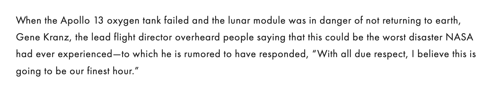

The President of Trinity Western University recently tweeted a brief recognition of the work that educational technologists have been doing over the last few weeks.

<blockquote class="twitter-tweet">
Grateful for, and proud of, Scott, Colin, and the entire TWU Online team: they saw the challenge and opportunity to help our faculty move teaching online as “their finest hour” (cf. <a href="https://t.co/Qoy6mw4Q5J">https://t.co/Qoy6mw4Q5J</a> ) <a href="https://t.co/yrDCSONUOX">https://t.co/yrDCSONUOX</a>
&mdash; Mark Husbands (@TWU_pres) <a href="https://twitter.com/TWU_pres/status/1239945046046027776?ref_src=twsrc%5Etfw">March 17, 2020</a></blockquote>

While it was nice to get a shout-out, I was curious about the 'finest hour' reference and the mysterious link.

<a class="embedly-card" data-card-controls="0" href="http://gretchenschmelzer.com/blog-1/2020/3/10/can-we-make-this-our-finest-hour">This can be our finest hour -- but we need all of you. - Gretchen Schmelzer</a>

I am not familiar with Gretchen Schmelzer, and this was a good read. The 'finest hour' reference was inspired by Gene Kranz of NASA during the Apollo 13 crisis.

> When the Apollo 13 oxygen tank failed and the lunar module was in danger of not returning to earth, Gene Kranz, the lead flight director overheard people saying that this could be the worst disaster NASA had ever experienced—to which he is rumored to have responded, “With all due respect, I believe this is going to be our finest hour.”

!!!! By the way, if you haven't heard it yet, you should listen to [13 minutes to the moon](https://www.bbc.co.uk/programmes/w13xttx2) from the BBC which tells the story of the Apollo 11 moon landing.

<a class="embedly-card" data-card-controls="0" href="https://www.bbc.co.uk/programmes/w13xttx2">BBC World Service - 13 Minutes to the Moon</a>

I'm no historian, but it doesn't take a rocket scientist to see that Gene Kranz may have been prepared for Apollo 13 partly because of Apollo 11. The confidence that hears 'Catastrophe!!' and responds with 'Nah, we got this' comes from a deep knowledge and understanding of the job to be done and what it will take to do it well.

I do get the feeling that, while an #OnlinePivot may not be quite as grandiose and sexy as landing on the moon, the sense that 'We got this' is strong because we've done the work. We know what effective distance education looks like.

Many of us spent a weekend scrambling to pull together a coherent set of resources for faculty who have never seen a need to think about how to engage learners remotely. But we all knew what the message would be...

- show compassion
- embrace the messiness
- scale back
- maintain connections with learners
- communicate
- extend grace
- rethink assessment (it's taken a pandemic, but here we are)

We also all knew what the message would not be...

- technology will save us
- add all the clicky-bling
- surveillance = security
- digital = equitable

As of this writing, I am two weeks into this fork of higher ed. Faculty are starting to see some of the advantages of stepping beyond the *status quo* of lecture-based praxis. But some learners are starting to see that moving crappy IRL learning design to online is still crappy.

There is an opportunity here to use this crisis as an actual inflection point in how we engage learners in higher ed. Yes, the pandemic will pass and there will be pressure to abandon this fork for the comfort of the *status quo*, but there will also be the opportunity to create a new *status quo* that merges [equitable assessment practices](https://vimeo.com/398392036), [constructively aligned learning environments](https://create.twu.ca/coursedesign/about/learning-outcomes/), [kindness](https://hybridpedagogy.org/pedagogy-of-kindness/), and [multi-access](https://www.learntechlib.org/primary/p/31583/) with the best of IRL learning environments.

There is a caution in my mind that people who have never experienced a highly engaging remote learning environment will equate this rush to Zoom with effective remote learning. A little bit of what we have seen in the last few weeks has been a panicked frenzy to replicate rich in-person classroom experiences in a much leaner web-conferencing environment. This is the tendency anyways when people think about moving online, and it isn't deep enough. The best decisions are rarely made in a panic.

Instead of trying to replicate the in-person classroom, real change will only come from rethinking the entire project. To be clear, that does not mean *changing* the entire project, but it does mean that systemic change needs to happen at a foundational level.

For example, in many in-person classes, there is an expectation of a proctored final exam that sets up a game of cat and mouse between learners (trying to smuggle in illicit materials or methods of contacting someone outside) and teachers (trying to catch them). The temptation to use this same strategy in a remote context (see ProctorU and many others) is the same as the pressure to use Zoom to replicate in-person events.

First of all, learners have the upper hand in communicating through digital media. Requiring learners to write their exam with a Zoom camera on is a fool's errand in security theatre. That strategy is trivially easy to work around. So the problem here isn't a lack of surveillance (when has that ever been a real problem in higher ed?). Dig a little deeper and it is obvious that the problem is crappy exams. Dig deeper still and the problem is that exams are crappy assessments.

What distance educators have known for decades is that assessment practices in remote learning environments must be different from the *status quo*. We also know that the assessment practices that we have been using in remote learning environments for decades can easily be used in in-person environments. [Furthermore, when we do that, those who are typically disadvantaged by traditional high-stakes testing become actually able to demonstrate their learning in ways we might never have imagined.](https://create.twu.ca/help/online-learning-on-ramp/finishing-well/rethinking-assessment)

So if the long-term response to COVID-19 is nothing more than moving existing practices to Zoom or Moodle, we will miss this opportunity. If, however, we use this crisis to stimulate deeper examination of what we know about assessment, then we might make some headway.

> there can be, and usually is, some degree of pain involved in giving up old ways of thinking and knowing and learning new approaches. ~bell hooks

---

Photo by [Lloyd Dirks](https://unsplash.com/@lloyddirks?utm_source=unsplash&utm_medium=referral&utm_content=creditCopyText) on [Unsplash](https://unsplash.com/collections/352507/pivot?utm_source=unsplash&utm_medium=referral&utm_content=creditCopyText)
