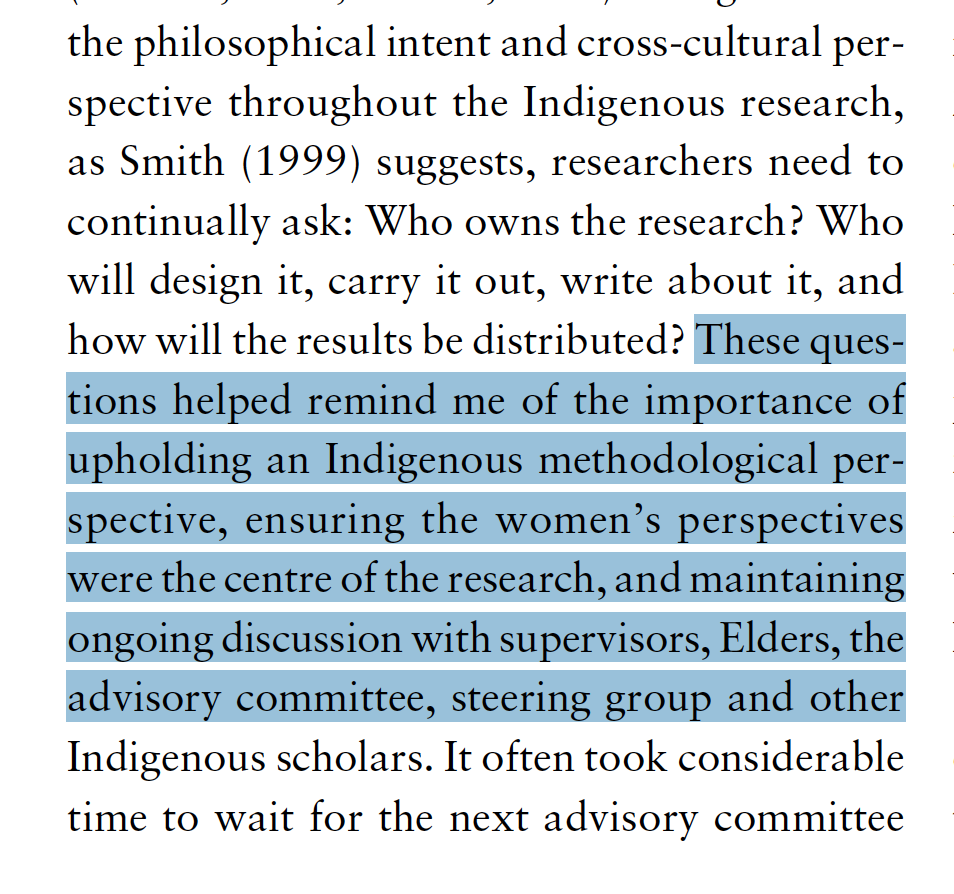
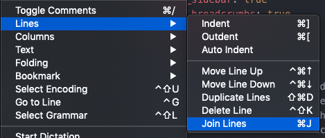

One of the things that has driven me a little batty ever since my MEd work, when I first started having to use PDF versions of articles is that copying text from a PDF for my notes and pasting into Werd works relatively fine except for the fact that the line breaks are copied too.

===

When you past into Werd, you have to manually remove all those hard returns at the end of every line or else Werd will panic and start doing We(i)rd things.

I've discovered the same thing happens in [Atom.io](https://atom.io). The text is pasted as plain text, so with no formatting from the original, but the line breaks are still there.

This morning, I started poking around and found this!

All I have to do is select the text and hit `CMD+J` and bombdiggity.

!!! Content in this post is from **Kurtz, D. L. M. (2013). Indigenous Methodologies: Traversing Indigenous and Western worldviews in research. *AlterNative: An International Journal of Indigenous Peoples, 9*(3), 217–229. [https://doi.org/10.1177/117718011300900303](https://doi.org/10.1177/117718011300900303)**
