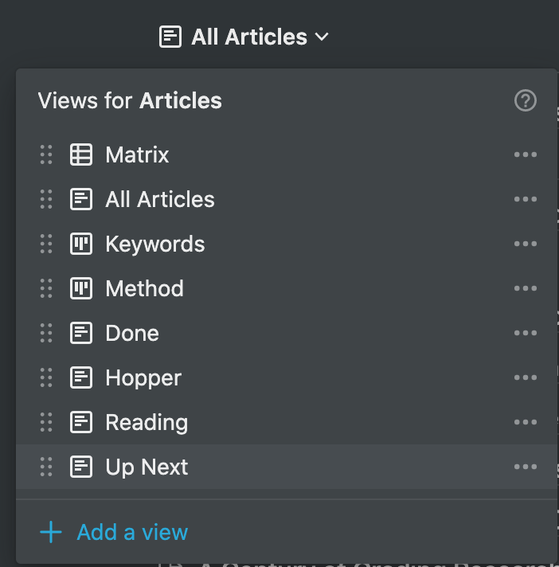
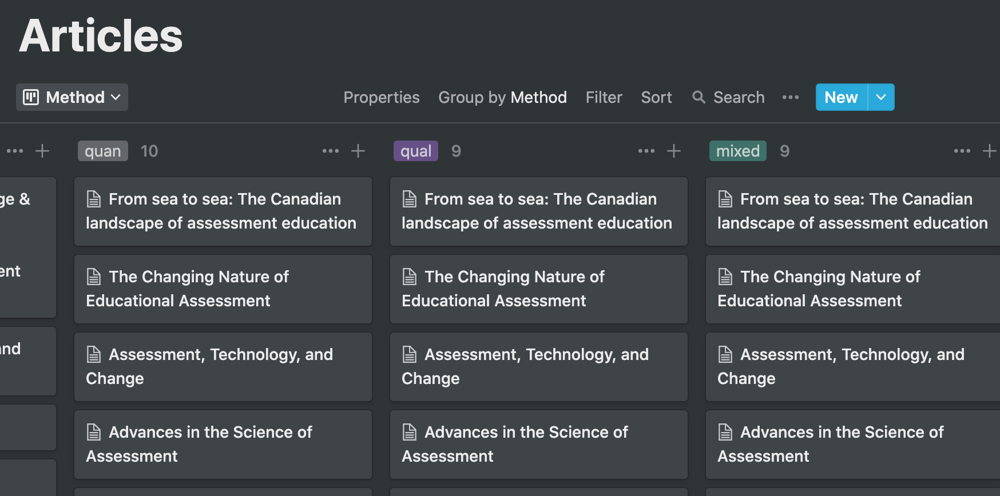

Each article or chapter I read gets an entry into my `Articles` database. The main view is a list of all articles, sorted alphabetically by author. I also have tremendous flexibility to create other views as well.

Each view is the same database, but sorted, filtered, and displayed differently. For example, the view below is the database displayed on a kanban board grouped by the `Method` tag.

You can see the metadata that I create around each article as a way to help organize things. I suspect that if I were trying to do a PhD before digital technologies, I would be significantly less organized.

Many people use Zotero or other citation management tools, and those are indispensable and a key part of my workflow. However, I find the interface for metadata to be clunky, and searching and sorting are downright awful.
