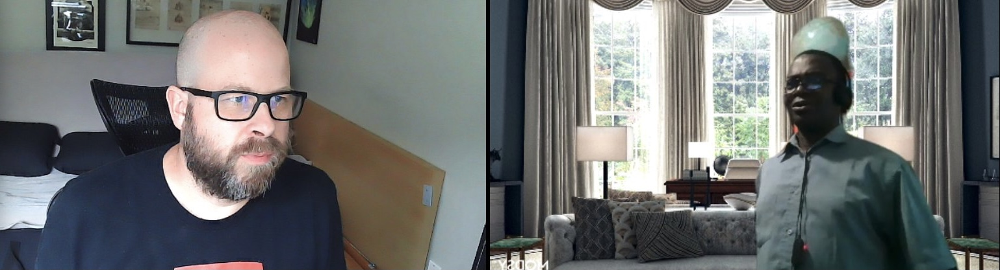

## Digital Platforms And Algorithmic Erasure
#### What are the implications?
##### Colin Madland (TWU, UVic), Maxwell Ofosuhene (TWU), Jennifer Adkins (TWU, UBC)

Find these slides at <https://bit.ly/otessa22-a>

---

### Acknowledging the Land and the People

We are located on the traditional, ancestral, and unceded territory of the Kwantlen, the Katzie, and the Stó:lô First Nations. We work here as an uninvited visitor and honour and respect the Indigenous Peoples who have stewarded this land and whose relationship to it continues to this day.

---

[notes]
In the fall of 2020, just as universities were beginning the first full semester of COVID, Maxwell and I were in a meeting together, and afterwards, Maxwell asked me to help troubleshoot Zoom. Apparently, his head kept disappearing from the feed when he used a virtual background. It quickly became clear to me what was happening, and we began a conversation about digital camera algorithms, white balance, and the long-standing issue of Black people not being visible in photographs.
[/notes]

---
