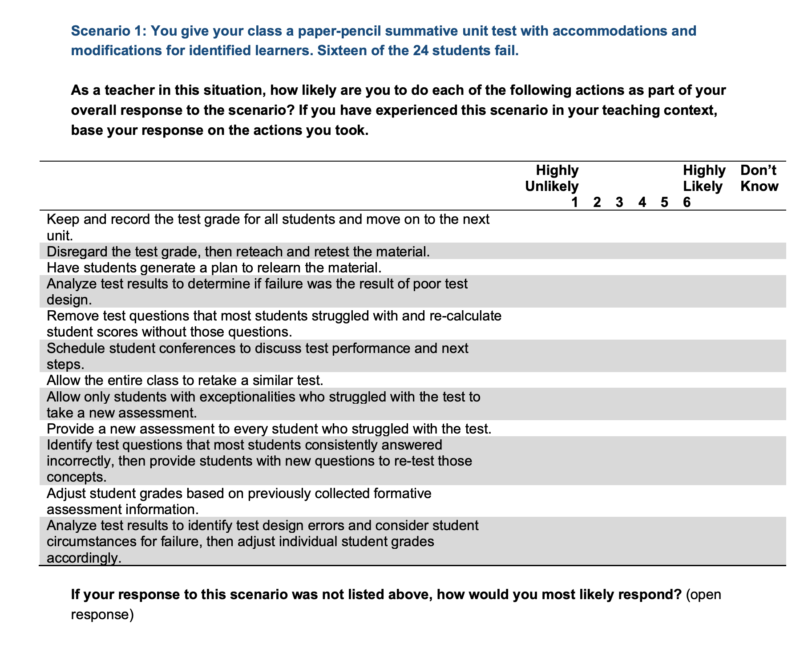

### Approaches to Assessment in Online Higher Education
#### Colin Madland, M.Ed.

#### Ph.D. Candidacy Oral Presentation, University of Victoria

#### Thursday, August 26, 2021

---

### Acknowledging the Land and the People

I acknowledge with respect the Lekwungen (Le-KWUNG-en) peoples on whose traditional territories the University of Victoria stands and the Songhees (Song-hees), Esquimalt (Ess-KWY-malt) and the W̱SÁNEĆ (Wa-San-nic) peoples whose historical relationships with the land continue to this day.

---

# Problem

---

^It used to be that assessment practices and understandings of cognition were in alignment. The behaviourists of the early and mid-20th century argued that learning was a matter of rewarding success in a highly atomized knowledge structure. As such, assessing learner knowedge of that structure could be accomplished by determining whether learners could recognize or identify the correct answer to a series of factual questions about the subject. So the use of selected response tests fit well with the model of cognition of the day.

---

^ However, even as our understanding of cognitive processes and learning have advanced beyond the rewards and punishments of behaviourism towards social constructivist practices, assessment practices have remained relatively unchanged. Consequently, there is a misalignment between common assessment practices in higher education and modern understandings of human cognition.

---

^Complicating the challenge is the trend, accelerated by COVID-19, towards greater use of technologies in higher ed and the pressures from employers who are looking for graduates who display competence in creative and divergent thinking, not only recall or recognition of content knowledge.

---

^Finally, assessment practices exert profound influence on learners and their experiences of higher education, so, taken together, I would like to investigate this misalignment, beginning with understanding instructors foundational beliefs about assessment practices in higher education, their approaches to assessment, and then exploring how those beliefs impact learner experiences.

---

# Purpose

> The purpose of this research is to investigate current approaches to assessment among higher education instructors and the impacts of those on learners.

---

# Questions

- Are there distinct patterns in higher education instructors’ approaches to assessment in Canada?
- Does the prevalence of these patterns differ by:
  - instructors’ levels of experience in teaching face-to-face versus online?
  - instructors’ levels of experience using technology?

---

# Questions

- What factors influence instructors’ approaches to assessment?
- How do different assessment strategies affect learners’ experiences?

---

# Working Definitions

---

# Assessment

> “a process of drawing reasonable inferences about what students know on the basis of evidence derived from observations of what they say, do, or make in selected situations” (Pellegrino et al., 2001, p. 112)

---

# Assessment Literacy

> competence or knowledge in educational assessment (DeLuca et al., 2016; Oxford English Dictionary, n.d.)

^The Oxford English Dictionary defines literacy as "The ability to ‘read’ a specified subject or medium; competence or knowledge in a particular area.", so assessment literacy is competence or knowledge in educational assessment. The OED definition also implies, in the ability to 'read' a subject, that there is an element of judgement and expertise involved.

---

# Approaches to Assessment

> "theoretical and philosophical orientations towards assessment purposes, processes, fairness and theory" (DeLuca et al., 2021, p. 2)

^The idea of approaches to assessment has grown out of the literature on assessment literacy and represents the view that there aren't necessarily 'correct' beliefs or a canonical set of skills required of all instructors and that becoming assessment literate is a contextually-influenced process (DeLuca et al., 2016).

---

# Theoretical Framework

^Since 1990, there have been several frameworks proposed for modelling the assessment skills or dispositions necessary for educators. Initial frameworks were published for the K-12 context in the form of sets of standards for high quality assessment practices. These sets of standards were often grounded in behaviourist perspectives of teaching and learning and eventually became outdated. Modern views have evolved to include the idea of assessment literacy as a multi-dimensional construct with a wide variety of influences. Contrary to K12 contexts, though, it seems that a framework for understanding assessment literacy among higher ed instructors should consider their general lack of formal preparation for teaching or assessing learning (Lipnevich et al., 2020; Massey et al., 2020).

------

^As a theoretical framework, I draw on DeLuca et al's work in *Approaches to Classroom Assessment* which is reflective both of modern conceptions of pedagogy and also of the multi-dimensional nature of assessment beliefs and practices in classrooms. DeLuca et al.'s model consists of four themes of assessment literacy, each with three dimensions. The four themes are 'Assessment Purpose', 'Assessment Process', Assessment Fairness, and Assessment Theory.

---

# Assessment Purpose

- Assessment *of* Learning
- Assessment *for* Learning
- Assessment *as* Learning

^The first theme, assessment purpose, comprises three dimensions: assessment of learning, assessment for learning, and assessment as learning. Assessment of learning is also known as summative assessment involving instructors gathering evidence of learning from written tests, performance tests, or other situations where learners are required to demonstrate their achievement of the learning outcomes. Assessment of learning usually leads to the assignment of a final grade. Assessment for learning is focused on both instructors and learners acquiring information about their performance that leads to formative feedback that informs future learning activities. The final dimension is assessment as learning which reflects activities which encourage learners to take metacognitive approaches to future learning activities based on the data gathered in learning activities.

---

# Assessment Processes

- Design
- Use and Scoring
- Communication

^The second theme, assessment process, relates to the logistics of creating, scoring, and communicating the results of assessments. Assessment design is the creation of reliable assessments and items intended to provide evidence with which instructors can infer learning in relation to learning outcomes. Use and scoring relates to the protocols instructors use to score learning data, and communication is the process of inferring achievement and communicating that to learners.

---

# Assessment Fairness

- Standard
- Equitable
- Differentiated

^The assessment fairness theme focuses on the beliefs of instructors regarding issues of fairness and whether they take a standard approach where all learners are treated equally, an equitable approach where learners with formally identified needs (psychoeducational diagnoses...) are provided with differentiated protocols, and a differentiated approach where all learners' unique needs are addressed.

---

# Assessment Theory

- Consistent
- Contextual
- Balanced

^Assessment theory is the theme that addresses instructors' knowledge and application of assessment theory. A consistent approach is demonstrated in ensuring consistency in the design, development and scoring of assessments (reliability), a contextual approach ensures the assessment is measuring what it purports to measure (validity of inferences), and a balanced approach considers both the reliability and validity of assessments.

---

#Learner Impact

^I acknowledge the fact that my analysis of  the literature on the impact of assessment beliefs and practices on learners was far too limited, a gap which will be addressed in my formal proposal. There is a robust body of literature in this area with a common framework being Biggs' (1993, 1999) 3P model of teaching and learning. I am not yet settled on the possible role of the 3P model of teaching and learning. I would argue that the 3P model provides a framework for integrating analyses about instructor approaches to assessment and the impact of assessment practice on learners. This is a question that would benefit from substantive conversation. I present the 3P model here as a component of my current thinking.

---

^The 3P model of teaching and learning models three phases in a learning experience. Those influences that precede the learning experience include both learner factors (prior learning experiences, including assessment experiences) and instructor factors (including beliefs about assessment, course policies, grading schemes). These factors influence the approaches that learners take to their learning. The direct, 2-way connection in the 3P model between learner factors and the teaching context, as well as the model's broad use in higher education contexts suggests it may be a useful tool for situating the idea of approaches to assessment (primarily investigated in the context of k12) within the context of teaching and learning in higher education.

---

# Technology

^Technology has played a role in how instructors approach assessment, especially since the COVID-19 pandemic. Typically, researchers suggest that technology is used to reinforce or improve the efficiency of traditional approaches to assessment (Oldfield, et al. nd; Timmis, et al. 2016) although there are other researchers who identify the promising potential of technology to enhance assessment practices, expecially in light of the changing nature of higher education (Webb & Ifenthaler, 2018).

---

# Methods

> "the methods chosen and the strategies used [must] serve the *purpose* of the research" (Bazeley, 2018, p. 8; emphasis in original)

^In considering methodologies and methods to answer my research questions I first considered the methodologies and methods identified in my review of the literature and also the purpose of the study I will be proposing. As identified in my paper, there are examples of researchers using quantitative, qualitative, and mixed methods to investigate assessment literacy, approaches to assessment, and the impacts of assessment on learners. It seems fitting that as understandings of assessment have grown in complexity, so have the methodologies and methods used in research.

---

# Mixed Research

> Mixed methods research is the type of research in which a researcher or team of researchers combines elements of qualitative and quantitative research approaches (e.g., use of qualitative and quantitative viewpoints, data collection, analysis, inference techniques) for the broad purposes of breadth and depth of understanding and corroboration. (Johnson, et al. 2007, p. 123)

^Mixed research approaches are intended to draw on the strengths of both quantitative and qualitative approaches in order to minimize the weaknesses of each approach. A mixed approach is justified for the study I will propose due to an epistemological alignment between the study and the philosophically pragmatic approach of many mixed research projects, the purposes of the study, and the exploratory nature of the study.

---

# Visualizing Mixed Research

---

^In planning a mixed research project it is helpful to diagram the different phases and components of the project to more clearly understand the flow, the inputs, and outputs. The project I intend to propose includes a pilot phase followed by a concurrent QUAN+qual data collection and analysis phase, in turn followed by a QUAL collection and analysis phase. The pilot phase is necessary for two primary reasons: first, the quantitative data collection instrument, the *Approaches to Classroom Assessment Inventory* (DeLuca, 2016) was design specifically for k12 contexts and has not, that I have been able to find, been used to investigate the approaches to assessment in higher education instructors. Consequently, a pilot phase may help me understand whether the model as structured is appropriate for use with higher ed instructors. Also, the instrument will require some modifications to better fit the higher ed context, and those modifications will need to be piloted.

---

^Key to mixed research projects is the collection of multiple types of data, analyzing the two sets separately (although sometimes with previous analyses informing subsequent analyses), following the protocols of analysis in each approach, then ensuring that there are connection points between the two approaches (Bazeley, 2018). Connection points in this project are shown with dotted lines. The pilot phase will inform phase 1 analysis, which will in turn inform phase 2.

---

# Participants and Sampling

^the intended population will be a stratified random sample of higher education instructors in English-speaking public Canadian universities. I will begin with a list of public HEI in each province (strata) and randomly select 2-4 universities from each province. I will send the invitation through the faculty associations of each institutions ensuring coverage of full-time faculty as well as sessional and part-time instructors. Each instructor who responds will be asked to nominate 8-10 learners from their classes. I will randomly select 2-3 instructor respondents from each province and send invitations to 4-5 of their nominated learners to participate in the semi-strucutred interviews. This process will create linked quantitative and qualitative data allowing me to connect specific assessment approach profiles of instructors to the responses of specific learners.

---

## Instrumentation (Phase 1)

^The instrument I intend to use for the project I will propose is the previously-mentioned *Approaches to Classroom Assessment Inventory (ACAI)*. The ACAI was created for and has been validated for use in K12 contexts, but not in higher ed, so will require modifications to how some items are phrased and also the previously-mentioned pilot phase. I also intend to add further opportunities for respondents to explain their responses by adding open-response questions.

---

## Instrumentation (Phase 2)

Possible questions:

- Please describe what you understand assessment to be.
- Did the assessment strategies that your instructor used help you to learn the course material?

^The semi-structured interview questions will be informed by the results and inferences drawn from the phase 1a+b analyses, but these questions represent possible starting points for the interviews.

---

- Did [instructor] use technology to administer assessments?
  - How did their use/not use of technology impact your performance on the assessments?
- Please describe your *favourite* assessment from [instructor]’s course [course name]?
  - What made that assessment your favourite?

---

# Data and Analyses

- Phase 1a
  - Ordinal data
  - Non-parametric tests
    - Mann-Whitney-Wilcoxon
    - Kruskal-Wallis

^Ordinal data are not suitable for descriptive statistical analyses (mean, standard deviation), non-parametric tests, such as Mann-Whitney-Wilcoxon  or the Kruskal-Wallis test will likely be necessary.

---

# Data and Analyses

- Phase 1b
  - theory-driven thematic coding
- Phase 2
  - transcripts
  - data-driven thematic approach

^As I am approaching this qualitative data with the approaches to classroom assessment model in mind, I will code the phase 1b data in alignment with the themes of assessment purpose, process, fairness, and theory while maintaining openness to new themes that might emerge. Phase 2 data will be in the form of audio recordings which will need to be transcribed (or the auto-transcriptions edited) and will be coded with a data-driven thematic approach to uncover emergent themes while maintaining openness to theory-based themes from phase 1.

---

# Known Gaps and Questions

- paper format
- impact on learners
- impact of technology
- sampling (required n)
- role of Biggs' 3P model
- scope of the project
- demographic questions re: technology and online teaching

---

# Contributions to Theory

- Validating the use of the ACAI in higher education contexts
- providing a theoretical understanding of higher education instructors' approaches to assessment

---

# Key Literature

Biggs, J. B. (1993). From Theory to Practice: A Cognitive Systems Approach. *Higher Education Research & Development*, *12*(1), 73–85. https://doi.org/10/ccdmd9

Black, P., & Wiliam, D. (1998). Assessment and Classroom Learning. *Assessment in Education: Principles, Policy & Practice*, *5*(1), 7–74. https://doi.org/10/fpnss4

---

Brookhart, S. M. (2011). Educational Assessment Knowledge and Skills for Teachers. *Educational Measurement: Issues and Practice*, *30*, 3–12. https://doi.org/10/cwcqj4

DeLuca, C., Coombs, A., Macgregor, S., & Rasooli, A. (2019). Toward a differential and situated view of assessment literacy: Studying teachers’ responses to classroom assessment scenarios. *Frontiers in Education*, *4*. https://doi.org/10/gh5k63

---

DeLuca, C., LaPointe-McEwan, D., & Luhanga, U. (2016). Approaches to classroom assessment inventory: A new instrument to support teacher assessment literacy. *Educational Assessment*, *21*, 248–266. https://doi.org/10/gfgtsg

Massey, K. D., DeLuca, C., & LaPointe-McEwan, D. (2020). Assessment Literacy in College Teaching: Empirical Evidence on the Role and Effectiveness of a Faculty Training Course. *To Improve the Academy*, *39*(1). https://doi.org/10/gj5ngz

---

Pereira, D., Cadime, I., Brown, G., & Flores, M. A. (2021). How do undergraduates perceive the use of assessment? A study in higher education. *European Journal of Higher Education*, 1–17. https://doi.org/10/gk36vq
