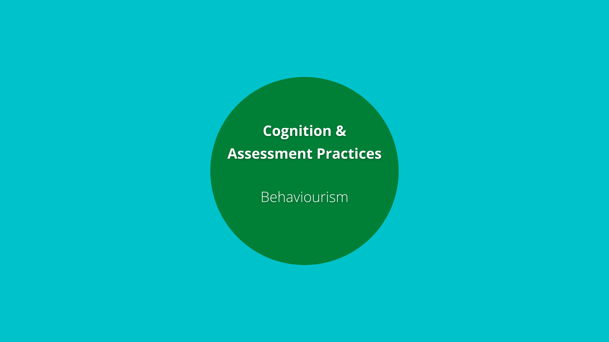
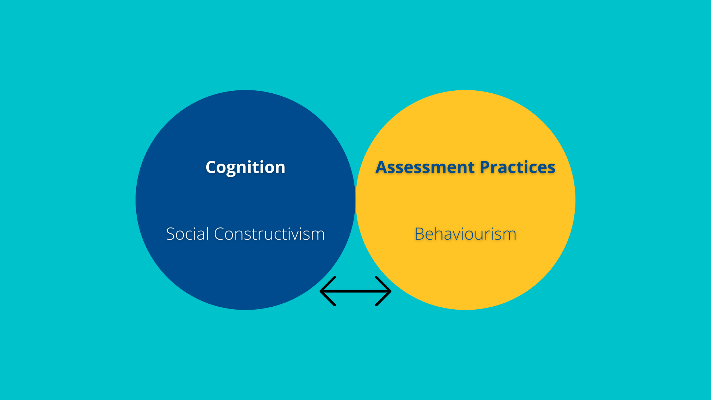

# Approaches to Assessment in Online Higher Education
### Colin Madland, M.Ed.

PhD Student, University of Victoria

Find these slides at <http://bit.ly/OTESSA21-A>

---

### Acknowledging the Land and the People

I acknowledge with respect the Lekwungen (Le-KWUNG-en) peoples on whose traditional territories the University of Victoria stands and the Songhees (Song-hees), Esquimalt (Ess-KWY-malt) and the W̱SÁNEĆ (Wa-San-nic) peoples whose historical relationships with the land continue to this day.

---

### Context

[notes]

[/notes]

---

### Assessment

> Use the chat to enter a word or three that represents 'assessment in online higher education'. How would you finish the sentence that begins 'Assessment is...'?

---

###### Assessment is a process of reasoning from evidence.

(National Research Council, 2001)

[notes]

How do we come to know what learners know?

[/notes]

---

### Assessment Triangle

---

---

### Validity and Reliability

---

---

High-stakes decisions (all grading decisions, really) should have a minimum reliability (co-efficient alpha, formerly known as Cronbach's alpha) of .08.

[notes]

Recall from this morning's keynote that most teacher-created assessments fall around 0.4...

[/notes]

---

### Assessment as Measurement

> You get what you measure. ~ Dr. Phil Laird

---

X=T+E

---

---

---

### The Problem with Percentages

---

---

### Humanizing Assessment

Think +1...

- reduced confidence in 'grades'
- fewer categories of achievement
- more flexibility
- ask learners
- Trust. Learners.
- more equity

---

### [Grading for Equity](https://gradingforequity.org/)

---

### Literature Sources

[Direct link to Notion.so](https://www.notion.so/edtechphd/7a55677d7d544d8689b20a85493f982b?v=dabcf187dd854c9e8af840752cb5ba45)
