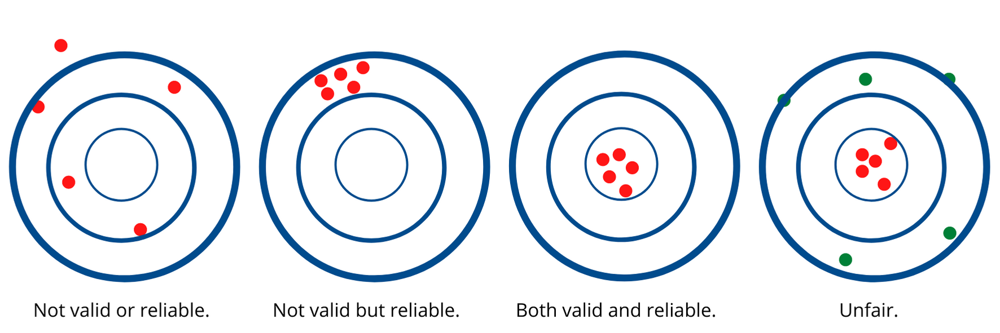
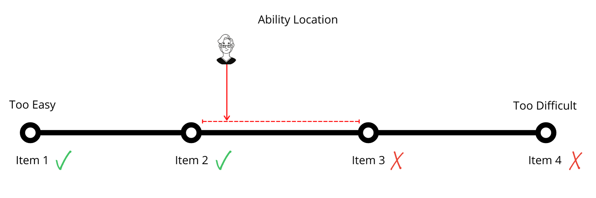
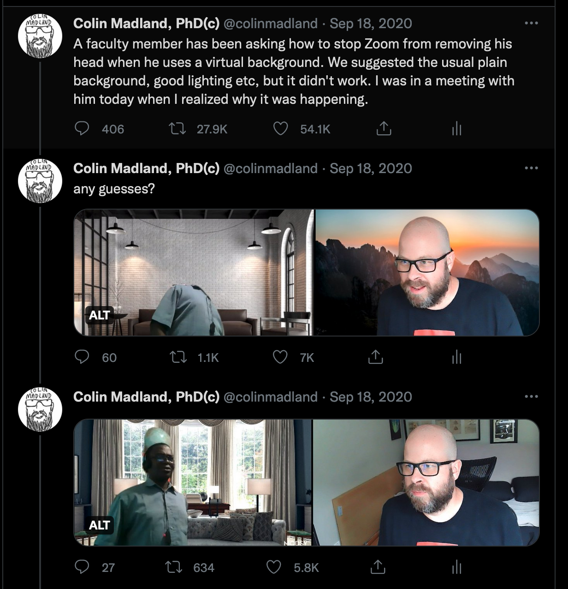

# Assessment Approaches in Higher Education 

### Colin Madland

PhD Candidate, University of Victoria, Curriculum and Instruction

---

Please be aware our session is being recorded to allow instructors who are not able to attend to watch later and will be posted on Teach Anywhere / Brightspace. It may also be used in further promotions within LTSI (website, social media, newsletters). If you do not want to be identifiable in the recording, turn off your webcam, change your display name, and participate via chat.

---

### Acknowledging the Land and the People

I acknowledge with respect the Lekwungen (Le-KWUNG-en) peoples on whose traditional territories the University of Victoria stands and the Songhees (Song-hees), Esquimalt (Ess-KWY-malt) and the W̱SÁNEĆ (Wa-San-nic) peoples whose historical relationships with the land continue to this day.

---

### Context

^As a result of the COVID-19 pandemic, my previous dissertation topic became impossible, but the resulting pivot to emergency remote teaching in the spring of 2020 laid bare many of the systemic inequities of higher ed in Canada. Since then, I have come to believe that assessment beliefs and practices can be powerful drivers for progress for the benefit of learners, or for hegemony and the status quo.

^This presentation is derived from my literature review supporting my dissertation project on assessment in higher education. I welcome your thoughts and questions.

---

>  Use the chat to enter a word or three that represents 'assessment in higher education'. 

^How would you finish the sentence that begins 'Assessment is...'?

^Responses might relate to purposes of assessment, reactions to assessment, beliefs about assessment, the results of assessment...

---

>  Assessment is a process of reasoning from evidence. (National Research Council, 2001)

^How do we come to know what learners know?

---

### Assessment Triangle

---

---

### Validity and Reliability

---

---

High-stakes decisions (all grading decisions, really) should have a minimum reliability (co-efficient alpha, formerly known as Cronbach's alpha) of .08, however...

---

> teacher-created assessments tend to fall around 0.4...

---

> You get what you measure. ~ Dr. Phil Laird

---

---

---

---

### The Problem with Percentages

---

^Assume 4 learners in a course with 4 equally-weighted graded assessments. You need to make decisions about their success in your course. You run your calculations and all 4 learners earn the same final percentage.

---

^Each learner scores 75% in the final tally of grades, and this is the single number reported to the Registrar. What does that number tell us? What does it possibly hide?

---

^Learner A's ability might seem to match their final grade, perhaps providing evidence that 75% is a good measurement of their true ability.

---

^Learner B has a very different performance profile, starting out poorly, but finishing well.

---

^Learner C has the exact opposite profile to Learner B...

---

^Learner D started out dismally...what will they need to do to earn 75%?

---

^All they need to do is ace every subsequent assignment to recover a decent grade. So...what things might be hidden in this data? Which learner might not have been able to afford the textbook until after the midterm? Which learner might have experienced the loss of a significant relationship? Which learner might have coasted despite being much more capable? Which learner might have been victim of a 'No make-up exams; no exceptions', or a 'No late assignments; no exceptions' rule? Who learned the most? Who learned the least? But most importantly, whose grade was affected by factors unrelated to their actual ability?

---

# Technology

---

- *status quo*, but more efficient
- new sources of error

---

---

---

---

### Humanizing Assessment

Think +1...

- reduced confidence in 'grades'
- fewer categories of achievement
- more flexibility
- ask learners
- Trust. Learners.
- more equity

---

### [Grading for Equity](https://gradingforequity.org/)

---

### Literature Sources

[Direct link to Notion.so](https://www.notion.so/edtechphd/7a55677d7d544d8689b20a85493f982b?v=dabcf187dd854c9e8af840752cb5ba45)
