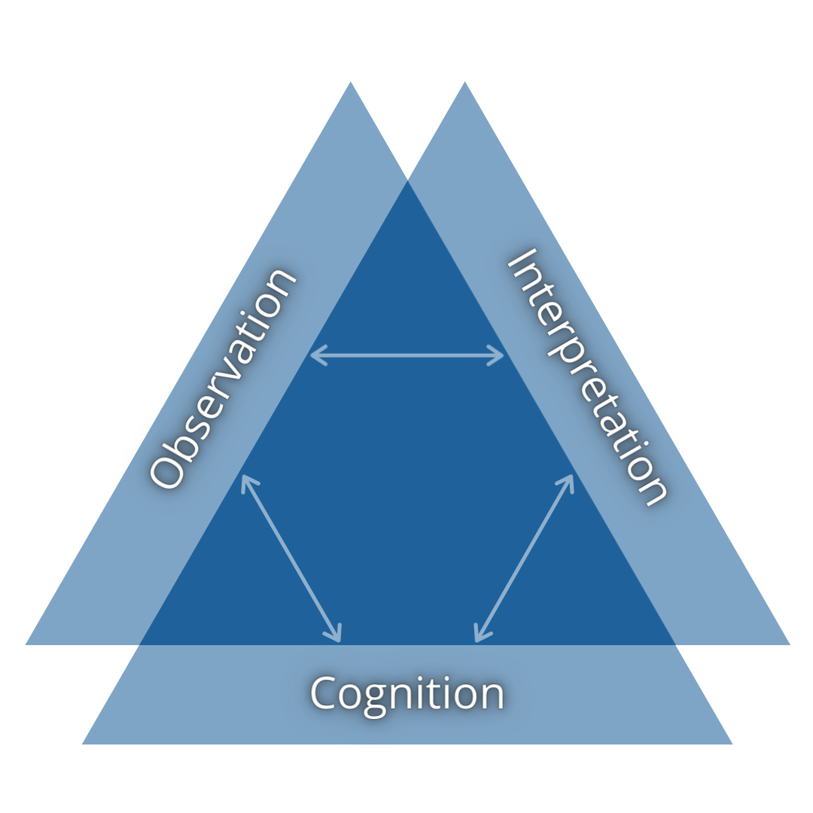
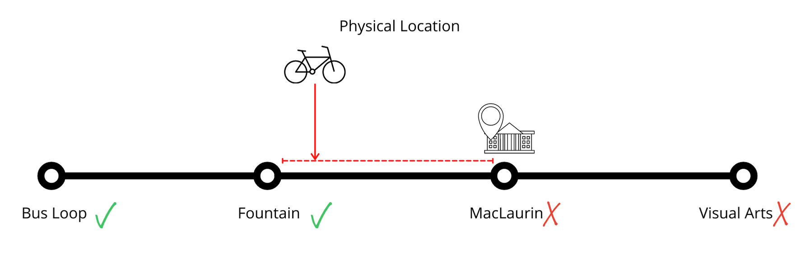

# Assessment Approaches in Online Higher Education

### Colin Madland

PhD Candidate, University of Victoria, Curriculum and Instruction

---

### Acknowledging the Land and the People

I acknowledge with respect the Lekwungen (Le-KWUNG-en) peoples on whose traditional territories the University of Victoria stands and the Songhees (Song-hees), Esquimalt (Ess-KWY-malt) and the W̱SÁNEĆ (Wa-San-nic) peoples whose historical relationships with the land continue to this day.

---

### Context

^As a result of the COVID-19 pandemic, my previous dissertation topic became impossible (see session 2.1), but the resulting pivot to emergency remote teaching in the spring of 2020 laid bare many of the systemic inequities of higher ed in Canada. Since then, I have come to believe that assessment beliefs and practices can be powerful drivers for progress for the benefit of learners, or for hegemony and the status quo.

^This presentation represents an early conceptualization of my dissertation project on assessment in online higher education. I welcome your thoughts and questions.

---

### Assessment

> Use the chat to enter a word or three that represents 'assessment in higher education'. How would you finish the sentence that begins 'Assessment is...'?

^
Responses might relate to purposes of assessment, reactions to assessment, beliefs about assessment, the results of assessment...

---

>  Assessment is a process of reasoning from evidence. (National Research Council, 2001)

^How do we come to know what learners know?

---

### Assessment Triangle

---

---

### Validity and Reliability

---

---

High-stakes decisions (all grading decisions, really) should have a minimum reliability (co-efficient alpha, formerly known as Cronbach's alpha) of .08.

^ most teacher-created assessments fall around 0.4...

---

### Assessment as Measurement

> You get what you measure. ~ Dr. Phil Laird

---

X=T+E

---

---

---

### The Problem with Percentages

---

---

### Humanizing Assessment

Think +1...

- reduced confidence in 'grades'
- fewer categories of achievement
- more flexibility
- ask learners
- Trust. Learners.
- more equity

---

### [Grading for Equity](https://gradingforequity.org/)

---

### Literature Sources

[Direct link to Notion.so](https://www.notion.so/edtechphd/7a55677d7d544d8689b20a85493f982b?v=dabcf187dd854c9e8af840752cb5ba45)
