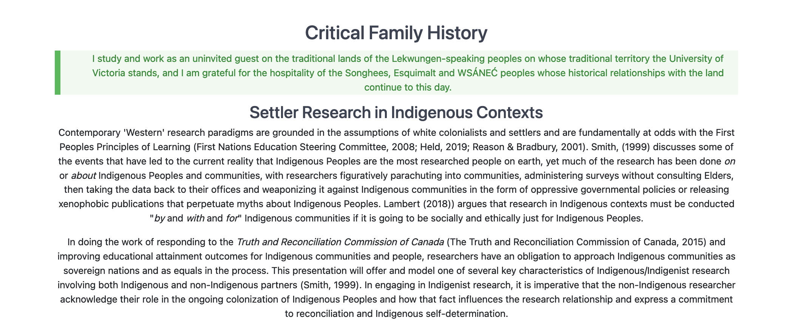

# Indigenous Digital Self-Determination
### Colin Madland

PhD Student, University of Victoria

Find these slides at https://madland.ca/presentations/indigenous-digital-sovereignty

---

### Acknowledging the Land and the People

The University of Alberta respectfully acknowledges that we are located on Treaty 6 territory and Homeland of the Métis, a traditional gathering place for diverse Indigenous peoples including the Cree, Blackfoot, Métis, Nakota Sioux, Iroquois, Dene, Ojibway/ Saulteaux/Anishinaabe, Inuit, and many others whose histories, languages, and cultures continue to influence our vibrant community.

---

Additionally, [I wish to acknowledge the devastating discovery of 215 residential school children very close to where I was born](https://tkemlups.ca/remains-of-children-of-kamloops-residential-school-discovered/) as an uninvited settler in Tk’emlúps te Secwépemc territory.

---

A note about this project...

- it is frustratingly incomplete
- it was disrupted by COVID
- it is possibly emblematic of the state of the 94 Calls to Action from the Truth and Reconciliation Commission

---

### Indigenist Research as a Settler

- supported by Indigenous Education department
- research ‘by’, ‘with’, and ‘for’ Indigenous communities, never ‘about’ or ‘on’
- locating and acknowledging yourself in history

---

---

<a class="embedly-card" data-card-key="05acda8fea1b4f099c92b66268f422dd" data-card-controls="0" data-card-type="article-full" href="https://doi.org/10.1177/0306396818823172">Digital colonialism: US empire and the new imperialism in the Global South - Michael Kwet, 2019</a>

---

### Extractive Colonization

- Railroads bypass local economies
- Gold and diamonds shipped directly to the coast, then overseas

---

### Digital Colonization

- GAFAM (Google, Apple, Facebook, Amazon, Microsoft) bypass local economies
- Uber takes a 25% premium on every ride plus hidden fees, leading to a net loss of revenue for the local economy
- Google takes 70%* of all advertising revenue in South Africa; Facebook another 12%

*These numbers are likely much higher today.

---

### Imperial control

- software
- hardware
- network infrastructure

---

### Software

- Digital Rights Management
  - companies (GAFAM) exercise complete control over how their software works and how much it costs
  - users cannot view or edit the code or share it with others

---

### Hardware

- software on 3rd party servers (SaaS)
  - [MS Office 365](https://downdetector.com/status/office-365/)
- centralized ownership of hardware leads to low-powered, low-memory consumer devices
  - [Google Chromebooks](https://www.cnet.com/news/laptop-vs-chromebook-whats-the-difference-and-which-is-best-in-2021/)
  - [Apple computers](https://venturebeat.com/2020/11/11/apples-first-m1-chip-based-macs-are-playing-it-too-safe/)
- hardware designed to prevent users from changing software
  - [Apple ecosystem](https://www.macrumors.com/2021/05/20/apple-right-to-repair-lobbying-efforts/)
  - [John Deere farm equipment](https://www.wired.com/story/john-deere-farmers-right-to-repair/)

---

### Network

- [Net Neutrality](https://www.michaelgeist.ca/2021/05/why-bill-c-10-undermines-the-governments-commitment-to-the-principle-of-net-neutrality/)
- [Underwater Cable Ownership](https://www.submarinecablemap.com/#/)
- [Internet.org](http://internet.org/)

---

> By its very design, Big Data violates privacy. ~ Kwet, 2019

---

> Four essential freedoms define Free Software: the freedom to run the programme as you wish; the freedom to study how the programme works, and change it; the freedom to redistribute verbatim copies; and the freedom to distribute copies of your modified versions to others. ~ Kwet, 2019

---

> I did not realize how completely tribal sovereignty shapes daily work in Indian Country and how ICTs play an integral role in circulating information critical to the daily exercise of sovereignty. ~ Marisa Elena Duarte, [“Network Sovereignty: Building the internet across Indian Country” p. 38](http://marisaduarte.net/tribalbroadband.html)

---

### KPYT-LPFM

Pascua Yacqui tribal radio in Arizona, California, and Mexico

- Streaming radio
- FCC licenses cubes for radio spectrum
- tribal lands are not squares
- language lessons, music, news, special programs
- Elders able to share traditional knowledge with younger generations

---

### K-NET
First Nations owned and operated ICT Service Provider serving remote communitites in Northern Ontario.

> K-Net materializes a wide range of ***capacity building services*** visualized by First Nations; such as cellular service, broadband connectivity, and online applications.

[Keewaytinook Internet High School](http://ned.knet.ca/)

---

> Before I began this project, I was operating under the following misguided assumptions. I presumed that most people on tribal reservations were impoverished and, as a result, had no reliable Internet or telecommunications services. I presumed that there was a fundamental zero-sum conflict between tribal traditions and digital design efforts; I underestimated the potential for Native peoples' digital creativity. I assumed tribes were not working together to address information and communication technologies and telecommunications problems and policies in Indian Country. I underestimated the effect of colonial legacies. ~ Marisa Elena Duarte, [“Network Sovereignty: Building the internet across Indian Country” p. 104](http://marisaduarte.net/tribalbroadband.html)
