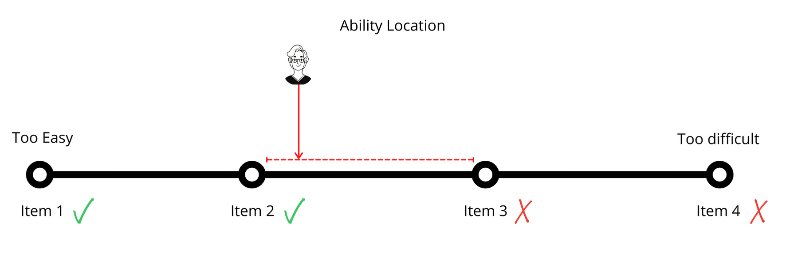

# Humanizing Assessment in Online Higher Education
### Colin Madland

PhD Student, University of Victoria

Find these slides at https://madland.ca/presentations/assessment-online-highered

---

### Acknowledging the Land and the People

The University of Alberta respectfully acknowledges that we are located on Treaty 6 territory and Homeland of the Métis, a traditional gathering place for diverse Indigenous peoples including the Cree, Blackfoot, Métis, Nakota Sioux, Iroquois, Dene, Ojibway/ Saulteaux/Anishinaabe, Inuit, and many others whose histories, languages, and cultures continue to influence our vibrant community.

---

Additionally, [I wish to acknowledge the devastating discovery of 215 residential school children very close to where I was born](https://tkemlups.ca/remains-of-children-of-kamloops-residential-school-discovered/) as an uninvited settler in Tk’emlúps te Secwépemc territory.

---

### Context

[notes]
As a result of the COVID-19 pandemic, my previous dissertation topic became impossible (see session 2.1), but the resulting pivot to emergency remote teaching in the spring of 2020 laid bare many of the systemic inequities of higher ed in Canada. Since then, I have come to believe that assessment beliefs and practices can be powerful drivers for progress for the benefit of learners, or for hegemony and the status quo.

This presentation represents an early conceptualization of my dissertation project on assessment in online higher education. I welcome your thoughts and questions.

[/notes]

---

### Assessment

> Use the chat to enter a word or three that represents 'assessment in online higher education'. How would you finish the sentence that begins 'Assessment is...'?

[notes]
Responses might relate to purposes of assessment, reactions to assessment, beliefs about assessment, the results of assessment...
[/notes]

---

###### Assessment is a process of reasoning from evidence.

(National Research Council, 2001)

---

### Assessment Triangle

---

---

### Assessment as Measurement

---

---

---

### The Problem with Percentages

---

---
