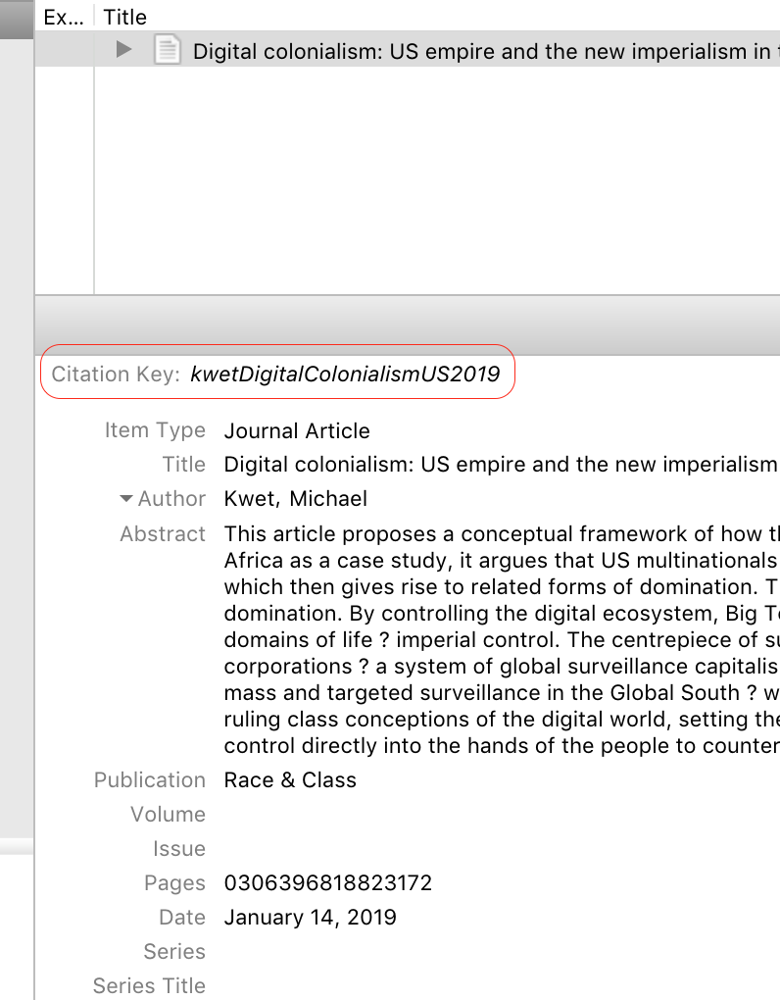
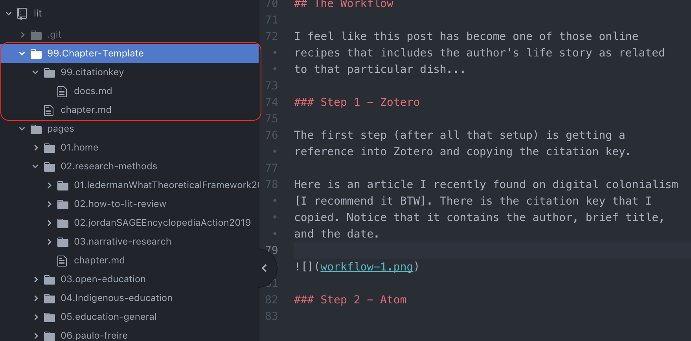
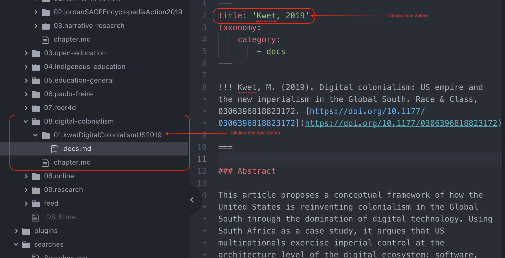
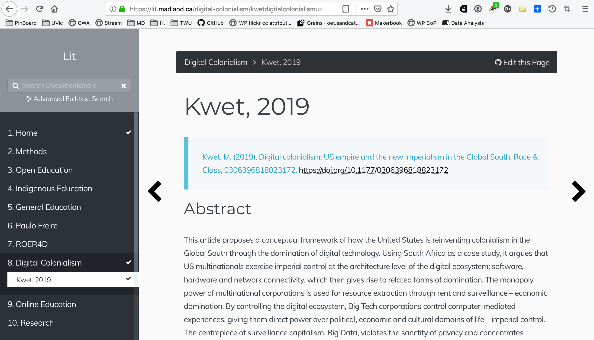

[embedly url="https://twitter.com/raulpacheco/status/1100659069126365184][/embedly]

A tweet showed up in my timeline, thanks to [@_valeriei](https://twitter.com/_valeriei), from [@raulpacheco](https://twitter.com/raulpacheco) talking about how he manages his workflow for printed papers. Here's my digital workflow. It takes a bit of technical setup, but it's worth it.

===

As I was gearing up to start my PhD last fall, I received a piece of advice that made a lot of sense at the time, and continues to do so. My colleague, [Inba](https://twitter.com/inbakehoe) told me to 'write while I read', meaning that I should take notes and summarize research while I read it, and not just read and underline article after article. That way, not only do I not lose my thoughts while I'm reading an article, but I am actively thinking through the arguments in the paper while I am reading it and my writing is thoroughly grounded in the literature.

Makes sense to me.

The next question is 'where to write', followed closely by 'how to organize'. Over the last few months, I've defined a workflow that is starting to become more refined as I go, and I suspect, will pay dividends in the coming months. Not only that, but it's open and forkable, so if you want a copy, help yourself.

There are a few digital tools that I use to make this all happen, and I'll describe more about the role of each as we go. Briefly, I use [Zotero](https://zotero.org) to manage all the literature, then a text editor called [atom](https://atom.io) to write in `Markdown`. Atom is editing files which live both on my local computer and on [GitHub](https://github.com), and once those files are edited on my computer, I `push` the changes to GitHub. Once the changes are reflected in GitHub, they are automagically synced to my website (this one) which is displaying the content of my pages through a flat-file CMS called [Grav](https://getgrav.org).

Once everything is set up, all my work happens between Zotero and Atom. I don't often need to touch GitHub or Grav.

I won't write too much here about getting set up with web-hosting, but if you want a quick recommendation, you should go check out [Reclaim Hosting](https://reclaimhosting.com) and sign up with them. They specifically serve educators and students and they do it very well and for an excellent price.

## Technicalities

### Git and GitHub

The entire backbone of my workflow is Git, which is software you can install on your computer to manage and track different versions of your documents. Collaborative version control is a tremendously powerful tool for working on documents both on your own and with other people. Git is `command line` software, meaning you have to use it from a `Terminal`, something which many computer users are unaccustomed to, and which takes some learning. However, there are several web services (GitHub, BitBucket, GitLab) which take advantage of Git software and provide a web interface which is easier to learn than using Git from the command line.

I use GitHub, but there are other systems that will work just as well. It's worth noting that Microsoft purchased GitHub in 2018 and that triggered a bit of an exodus to GitLab and BitBucket.

The very beginning of my workflow is a GitHub repository that has been synchronized with a Grav installation on my web-hosting account. You are currently viewing the Grav front end if you are at [grav.madland.ca](https://grav.madland.ca), and you can find the GitHub repo at [github.com/cmadland/phd](https://github.com/cmadland/phd). GitHub and Grav are connected with the GitSync plugin in Grav so that changes in one spot are automagically propagated to the other.

! Make sure you connect Grav to a GitHub repo with only a single initial commit.

### Grav

The next key is Grav along with the `Learn2 with GitSync` from [Hibbitts Design](https://demo.hibbittsdesign.org/grav-learn2-git-sync/) skeleton installed and active.

There are a couple other plugins that I have active, but a key one is the `TNTSearch` which provides a full-text search of my entire repository, and it is extremely fast.

### Atom

I do not enjoy MS Werd. It is a bloated piece of software with far more tools than I will ever need. The number of times I have tried to move an image a mm to one side or another and ended up with 3 new blank pages in my document that can't be deleted unless that image is moved back has completely killed any spark of joy I may have ever had.

Ever since I started writing in `Markdown` in a plain text editor (first ByWord, now Atom), I have enjoyed the freedom of just writing and not worrying about formatting at all.

The thing that makes Atom a killer app in my workflow is that it connects directly to my GitHub repo. Once my repo is cloned to my computer and opened in Atom, I have all the tools that I need to save my work locally, stage changes to ensure that I can review my edits, pull any changes that may have been made in GitHub, and push my edits back to GitHub. This all means that I can do almost all of my work on my desktop in a plain text editor and every change will be tracked.

### Zotero

If you need to write anything based on anything else and you need to include a bibliography or reference list, and you aren't using a citation manager like [Zotero](https://zotero.org) (or Bookends, EndNote, Mendeley, etc. I use Zotero because it is free and open source), you are doing more work than you need to do. There is excellent documentation on [Zotero's website](https://www.zotero.org/support/getting_stuff_into_your_library) about the various different ways to get the article info into Zotero (I'm sure the same is true for your preferred citation manager). Some databases and publishers will have some different variations on the process, but it is usually not more than a couple taps to get all the metadata for an article filed into your system.

Once it is there, I usually organize my library both topically and by project. I use collections liberally and will create and delete them pretty quickly as needed or not.

One of the key things I get from Zotero, besides the automagical citations and reference list in my document, is the `citation key` [I'm not sure, but this may be an artifact of the `BetterBibTex` plugin I have installed, but regardless, you can use this workflow without the citation key.]

## The Workflow

I feel like this post has become one of those online recipes that includes the author's life story as related to that particular dish...

### Step 1 - Zotero

The first step (after all that setup) is getting a reference into Zotero and copying the citation key.

Here is an article I recently found on digital colonialism [I recommend it BTW]. There is the citation key that I copied. Notice that it contains the author, brief title, and the date.

### Step 2 - Atom

Once I have the citation key copied, I head over to Atom and duplicate my chapter template folder which gives me a whole new chapter and document. This time I needed to create the new chapter called `Digital Colonialism`. Sometimes I only need a new document, so I can duplicate a document in an existing chapter.

Once that is created, I use the Zotero citation key as the title of the folder for the document. Then I change the title of the markdown file to match the citation from Zotero (Author, Date).

I start the document with the full bibliographic reference from Zotero, then head into a summary of the article.

My process of summarizing the article is still in flux. I copy the abstract and keywords, then pull quotes from the intro and conclusion for all articles. For some articles, I need to go deeper, so I will include quotes along with my commentary and thoughts.

I will often note the methods used in the articles, and am starting to make note of the theoretical framework.

As I work in Atom, I continually save my progress, and occasionally, I will stage my changes, indicating that they are ready to be pushed to GitHub. Less frequently, I will push to GitHub.

### Step 3 - GitHub (automated)
Once I do, however, GitHub keeps track of every change that I've made and assigns it a number and URL so that I can see what has been changed, when, and by whom.

### Step 4 - Grav (automated)

Once the changes are live in GitHub (usually a few seconds), the changes are also live in Grav. The front-end result is a fully searchable, indexed record of all my notes on all the literature for my lit review. The ToC on the left side is automagically generated and I can quickly see at a glance which articles I have read and summarized, what the key ideas are, and such.

---
I write these summaries for myself, but they are open on the web and anyone is welcome to fork my repo to take a copy and make it their own. I hope there are a few authors out there who have web notifications set up whenever someone publishes a link to their article. Maybe they'll drop by.

Feel free to leave a note if you find this helpful.

You can check out my [Lit Review site](https://lit.madland.ca) and the [GitHub Repo](https://github.com/cmadland/lit).

