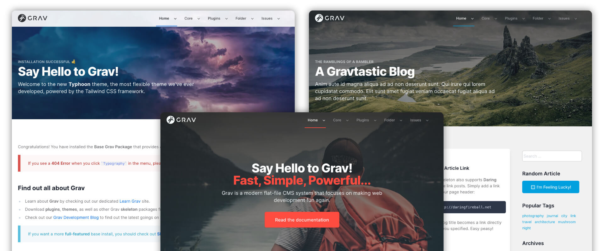

# Typhoon Theme

**Typhoon** for [Grav CMS](http://github.com/getgrav/grav) is a highly flexible theme that is built on top of the modern [Tailwind CSS](https://tailwindcss.com/) framework.  The theme provides a flexible architecture for building beautiful sites and serves as a great base for custom theme designs.  It makes use of the powerful theme variable system available in Grav to set global defaults and then override those at a page level.  

## Features

* Built on top of the latest Tailwind CSS framework
* Fully compatible with PurgeCSS to create high performance and optimized 'production' CSS files
* Fully responsive and built "mobile-first"
* Supports both "Light" & "Dark" themes
* Can use system settings, a specific variation, or user controlled light/dar theme preference
* User configurable 'primary' and 'default text' colors
* Flexible dropdown menu and side navigation support
* Responsive mobile menu with support for multiple levels of navigation
* Customizable logo including dynamic SVG logo support
* Configurable menu bar (auto, dark, light, transparent)
* Powerful Hero configuration for any page not just modular pages
* Fully configurable footer
* Clean default typography
* Blog Site example
* One-Page modular example with GLightbox gallery support + Contact form

## Important Links

* [Typhoon Documentation](https://getgrav.org/premium/typhoon/docs)
* [Typhoon Details](https://getgrav.org/premium/typhoon)